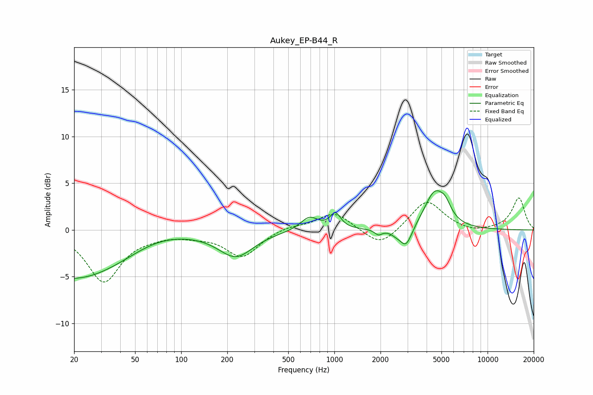

# Aukey_EP-B44_R
See [usage instructions](https://github.com/jaakkopasanen/AutoEq#usage) for more options and info.

### Parametric EQs
Apply preamp of -4.3 dB when using parametric equalizer.

|   # | Type    |   Fc (Hz) |    Q |   Gain (dB) |
|-----|---------|-----------|------|-------------|
|   1 | Peaking |        20 | 0.38 |        -5.3 |
|   2 | Peaking |        68 | 0.72 |         1   |
|   3 | Peaking |       227 | 1.24 |        -2.8 |
|   4 | Peaking |       686 | 2.45 |         1.4 |
|   5 | Peaking |      1016 | 4.1  |         1.6 |
|   6 | Peaking |      1938 | 5.99 |        -0.6 |
|   7 | Peaking |      2533 | 3.77 |        -0.4 |
|   8 | Peaking |      2940 | 3.54 |        -2.2 |
|   9 | Peaking |      4520 | 2.06 |         3.9 |
|  10 | Peaking |      5310 | 3.8  |         1.1 |

### Fixed Band EQs
When using fixed band (also called graphic) equalizer, apply preamp of **-3.5 dB** (if available) and set gains manually with these parameters.

|   # | Type    |   Fc (Hz) |    Q |   Gain (dB) |
|-----|---------|-----------|------|-------------|
|   1 | Peaking |        31 | 1.41 |        -5.5 |
|   2 | Peaking |        62 | 1.41 |        -0.4 |
|   3 | Peaking |       125 | 1.41 |        -0.4 |
|   4 | Peaking |       250 | 1.41 |        -2.8 |
|   5 | Peaking |       500 | 1.41 |         0.4 |
|   6 | Peaking |      1000 | 1.41 |         1.9 |
|   7 | Peaking |      2000 | 1.41 |        -1.9 |
|   8 | Peaking |      4000 | 1.41 |         3.2 |
|   9 | Peaking |      8000 | 1.41 |        -0.4 |
|  10 | Peaking |     16000 | 1.41 |         3.4 |

### Graphs

