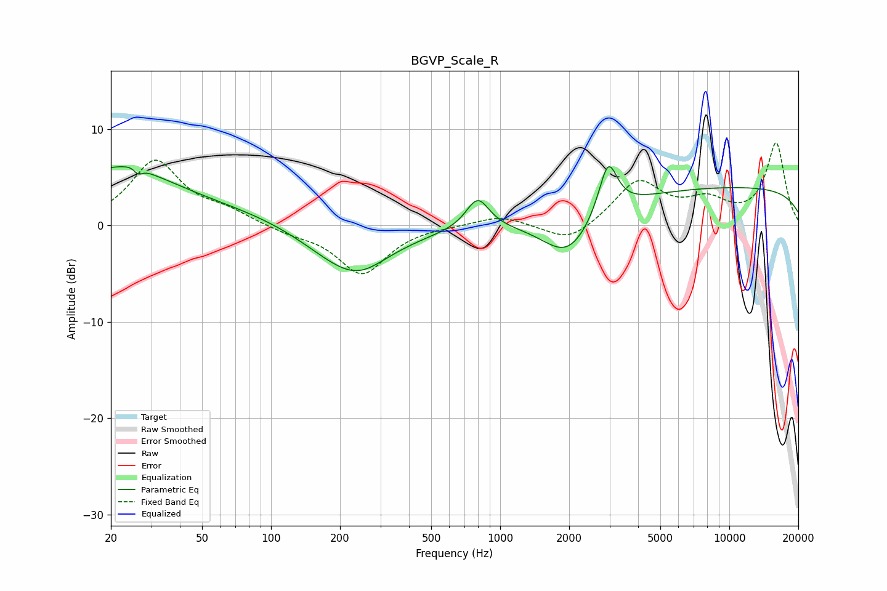

# BGVP_Scale_R
See [usage instructions](https://github.com/jaakkopasanen/AutoEq#usage) for more options and info.

### Parametric EQs
Apply preamp of -6.2 dB when using parametric equalizer.

|   # | Type    |   Fc (Hz) |    Q |   Gain (dB) |
|-----|---------|-----------|------|-------------|
|   1 | Peaking |        21 | 0.61 |         5.2 |
|   2 | Peaking |        26 | 5.28 |         3.2 |
|   3 | Peaking |        26 | 5.89 |        -3.6 |
|   4 | Peaking |        64 | 0.32 |         1.6 |
|   5 | Peaking |       214 | 0.74 |        -4.7 |
|   6 | Peaking |       247 | 1.43 |        -1.1 |
|   7 | Peaking |       798 | 2.79 |         3.2 |
|   8 | Peaking |      1976 | 1.26 |        -4.6 |
|   9 | Peaking |      2956 | 3.46 |         5.5 |
|  10 | Peaking |     10000 | 0.18 |         4   |

### Fixed Band EQs
When using fixed band (also called graphic) equalizer, apply preamp of **-8.6 dB** (if available) and set gains manually with these parameters.

|   # | Type    |   Fc (Hz) |    Q |   Gain (dB) |
|-----|---------|-----------|------|-------------|
|   1 | Peaking |        31 | 1.41 |         6.6 |
|   2 | Peaking |        62 | 1.41 |         1.2 |
|   3 | Peaking |       125 | 1.41 |        -0.7 |
|   4 | Peaking |       250 | 1.41 |        -5   |
|   5 | Peaking |       500 | 1.41 |         0   |
|   6 | Peaking |      1000 | 1.41 |         1.1 |
|   7 | Peaking |      2000 | 1.41 |        -2   |
|   8 | Peaking |      4000 | 1.41 |         4.5 |
|   9 | Peaking |      8000 | 1.41 |         2.2 |
|  10 | Peaking |     16000 | 1.41 |         8.5 |

### Graphs

