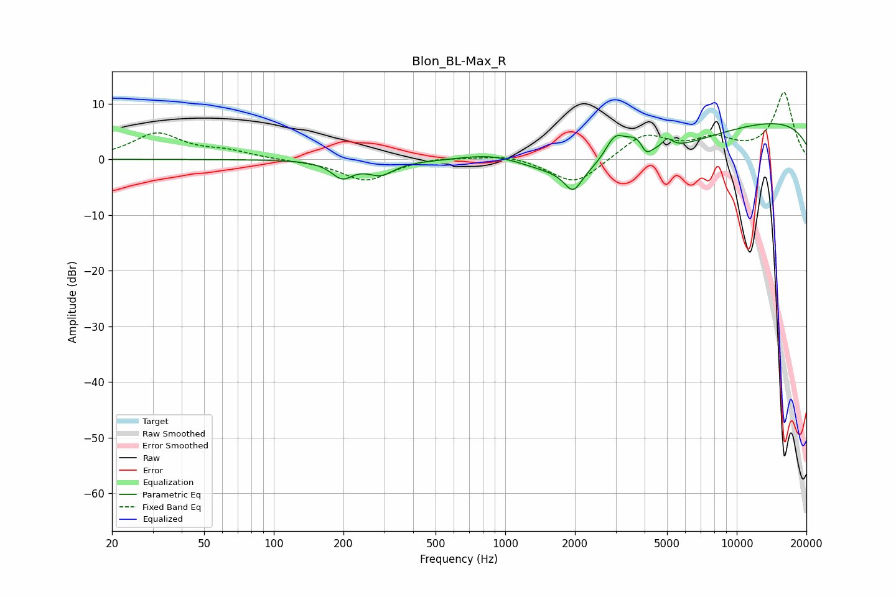

# Blon_BL-Max_R
See [usage instructions](https://github.com/jaakkopasanen/AutoEq#usage) for more options and info.

### Parametric EQs
Apply preamp of -6.5 dB when using parametric equalizer.

|   # | Type    |   Fc (Hz) |    Q |   Gain (dB) |
|-----|---------|-----------|------|-------------|
|   1 | Peaking |       198 | 3.02 |        -2.9 |
|   2 | Peaking |       289 | 2.42 |        -2.4 |
|   3 | Peaking |       900 | 0.89 |         2.9 |
|   4 | Peaking |      1964 | 3.8  |        -3.9 |
|   5 | Peaking |      2750 | 0.36 |        -7.2 |
|   6 | Peaking |      2982 | 3.01 |         5   |
|   7 | Peaking |      3702 | 3.05 |         3.5 |
|   8 | Peaking |      4050 | 5.83 |        -2.1 |
|   9 | Peaking |      5015 | 5.96 |         1.8 |
|  10 | Peaking |     10000 | 0.18 |         7.7 |

### Fixed Band EQs
When using fixed band (also called graphic) equalizer, apply preamp of **-12.1 dB** (if available) and set gains manually with these parameters.

|   # | Type    |   Fc (Hz) |    Q |   Gain (dB) |
|-----|---------|-----------|------|-------------|
|   1 | Peaking |        31 | 1.41 |         4.6 |
|   2 | Peaking |        62 | 1.41 |         1.3 |
|   3 | Peaking |       125 | 1.41 |        -0.2 |
|   4 | Peaking |       250 | 1.41 |        -3.8 |
|   5 | Peaking |       500 | 1.41 |         0.5 |
|   6 | Peaking |      1000 | 1.41 |         1   |
|   7 | Peaking |      2000 | 1.41 |        -4.7 |
|   8 | Peaking |      4000 | 1.41 |         4.5 |
|   9 | Peaking |      8000 | 1.41 |         3.1 |
|  10 | Peaking |     16000 | 1.41 |        11.9 |

### Graphs

