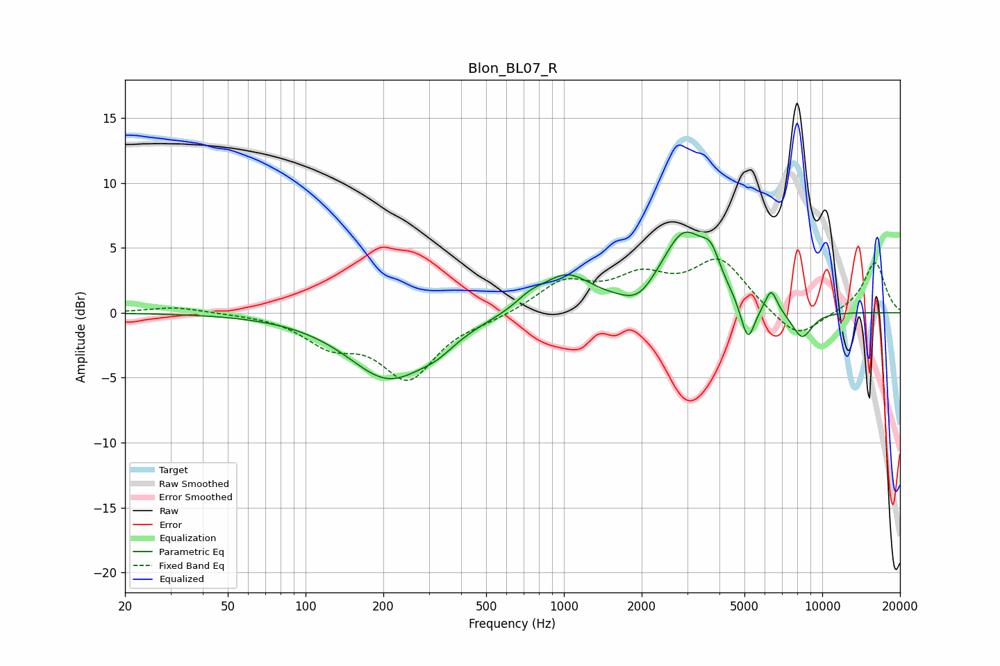

# Blon_BL07_R
See [usage instructions](https://github.com/jaakkopasanen/AutoEq#usage) for more options and info.

### Parametric EQs
Apply preamp of -6.3 dB when using parametric equalizer.

|   # | Type    |   Fc (Hz) |    Q |   Gain (dB) |
|-----|---------|-----------|------|-------------|
|   1 | Peaking |       210 | 0.89 |        -4.9 |
|   2 | Peaking |       324 | 1.97 |        -0.8 |
|   3 | Peaking |       738 | 2.55 |         0.7 |
|   4 | Peaking |      1022 | 1.43 |         2.8 |
|   5 | Peaking |      1945 | 2.29 |        -1.2 |
|   6 | Peaking |      2918 | 1.56 |         5.9 |
|   7 | Peaking |      3708 | 3.91 |         2   |
|   8 | Peaking |      5151 | 4.99 |        -3.2 |
|   9 | Peaking |      6347 | 6    |         1.7 |
|  10 | Peaking |      8347 | 3.16 |        -2.2 |

### Fixed Band EQs
When using fixed band (also called graphic) equalizer, apply preamp of **-4.2 dB** (if available) and set gains manually with these parameters.

|   # | Type    |   Fc (Hz) |    Q |   Gain (dB) |
|-----|---------|-----------|------|-------------|
|   1 | Peaking |        31 | 1.41 |         0.5 |
|   2 | Peaking |        62 | 1.41 |         0   |
|   3 | Peaking |       125 | 1.41 |        -2.1 |
|   4 | Peaking |       250 | 1.41 |        -4.8 |
|   5 | Peaking |       500 | 1.41 |        -0.4 |
|   6 | Peaking |      1000 | 1.41 |         2.3 |
|   7 | Peaking |      2000 | 1.41 |         2.4 |
|   8 | Peaking |      4000 | 1.41 |         3.9 |
|   9 | Peaking |      8000 | 1.41 |        -2.2 |
|  10 | Peaking |     16000 | 1.41 |         3.9 |

### Graphs

