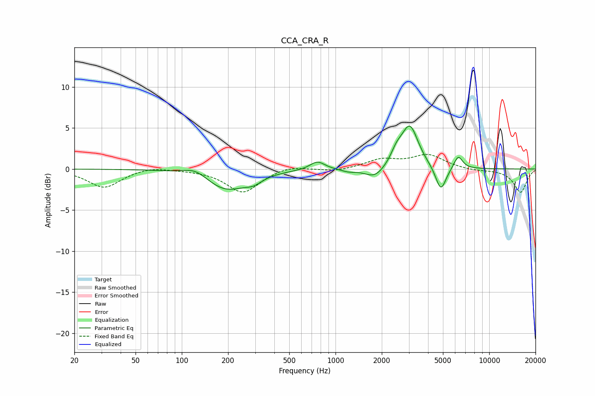

# CCA_CRA_R
See [usage instructions](https://github.com/jaakkopasanen/AutoEq#usage) for more options and info.

### Parametric EQs
Apply preamp of -5.3 dB when using parametric equalizer.

|   # | Type    |   Fc (Hz) |    Q |   Gain (dB) |
|-----|---------|-----------|------|-------------|
|   1 | Peaking |       123 | 1.77 |         1   |
|   2 | Peaking |       193 | 1.02 |        -2.6 |
|   3 | Peaking |       293 | 2.63 |        -0.7 |
|   4 | Peaking |       762 | 2.92 |         1   |
|   5 | Peaking |      1218 | 2.97 |        -0.3 |
|   6 | Peaking |      1807 | 2.2  |        -1.3 |
|   7 | Peaking |      2492 | 3.83 |         1.3 |
|   8 | Peaking |      3041 | 2.54 |         5.2 |
|   9 | Peaking |      4845 | 4.06 |        -3.1 |
|  10 | Peaking |      6288 | 4.86 |         1.6 |

### Fixed Band EQs
When using fixed band (also called graphic) equalizer, apply preamp of **-1.9 dB** (if available) and set gains manually with these parameters.

|   # | Type    |   Fc (Hz) |    Q |   Gain (dB) |
|-----|---------|-----------|------|-------------|
|   1 | Peaking |        31 | 1.41 |        -2.3 |
|   2 | Peaking |        62 | 1.41 |         0.4 |
|   3 | Peaking |       125 | 1.41 |        -0   |
|   4 | Peaking |       250 | 1.41 |        -2.9 |
|   5 | Peaking |       500 | 1.41 |         0.5 |
|   6 | Peaking |      1000 | 1.41 |        -0.3 |
|   7 | Peaking |      2000 | 1.41 |         1.1 |
|   8 | Peaking |      4000 | 1.41 |         1.7 |
|   9 | Peaking |      8000 | 1.41 |        -0.2 |
|  10 | Peaking |     16000 | 1.41 |        -2.8 |

### Graphs

