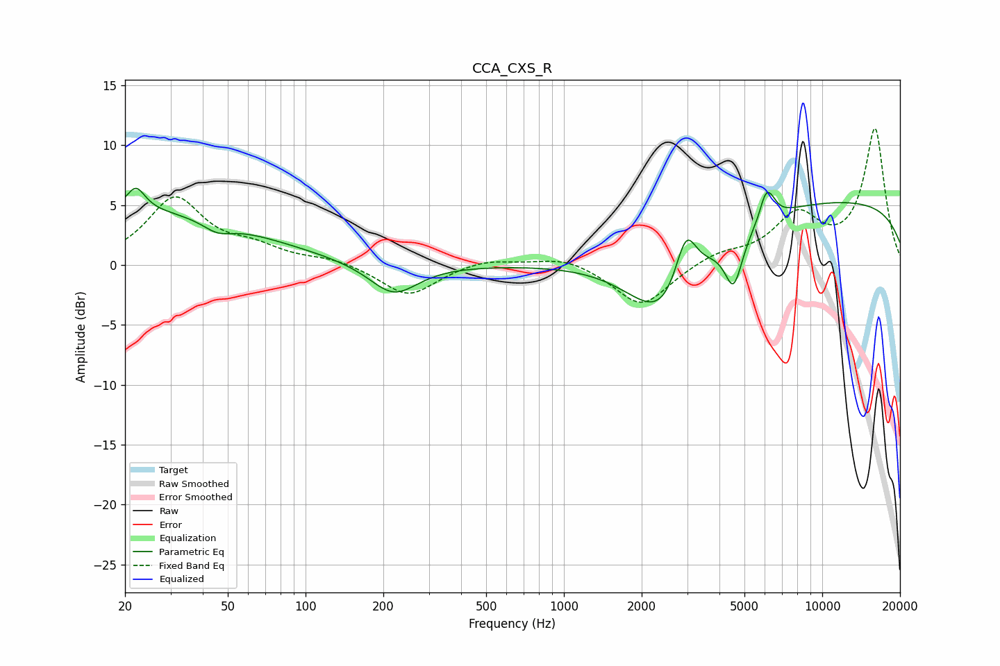

# CCA_CXS_R
See [usage instructions](https://github.com/jaakkopasanen/AutoEq#usage) for more options and info.

### Parametric EQs
Apply preamp of -6.5 dB when using parametric equalizer.

|   # | Type    |   Fc (Hz) |    Q |   Gain (dB) |
|-----|---------|-----------|------|-------------|
|   1 | Peaking |        22 | 0.3  |         4.5 |
|   2 | Peaking |        22 | 4.01 |         2   |
|   3 | Peaking |        46 | 2.46 |        -0.9 |
|   4 | Peaking |       219 | 1.51 |        -2.7 |
|   5 | Peaking |      2471 | 0.97 |        -7.1 |
|   6 | Peaking |      2966 | 3.3  |         4.8 |
|   7 | Peaking |      4541 | 4.05 |        -4.2 |
|   8 | Peaking |      6036 | 5.97 |         2   |
|   9 | Peaking |      6371 | 5.7  |         0.9 |
|  10 | Peaking |     10000 | 0.18 |         5.5 |

### Fixed Band EQs
When using fixed band (also called graphic) equalizer, apply preamp of **-11.5 dB** (if available) and set gains manually with these parameters.

|   # | Type    |   Fc (Hz) |    Q |   Gain (dB) |
|-----|---------|-----------|------|-------------|
|   1 | Peaking |        31 | 1.41 |         5.5 |
|   2 | Peaking |        62 | 1.41 |         1.2 |
|   3 | Peaking |       125 | 1.41 |         0.5 |
|   4 | Peaking |       250 | 1.41 |        -2.6 |
|   5 | Peaking |       500 | 1.41 |         0.6 |
|   6 | Peaking |      1000 | 1.41 |         0.8 |
|   7 | Peaking |      2000 | 1.41 |        -3.5 |
|   8 | Peaking |      4000 | 1.41 |         0.9 |
|   9 | Peaking |      8000 | 1.41 |         3.9 |
|  10 | Peaking |     16000 | 1.41 |        11.3 |

### Graphs

