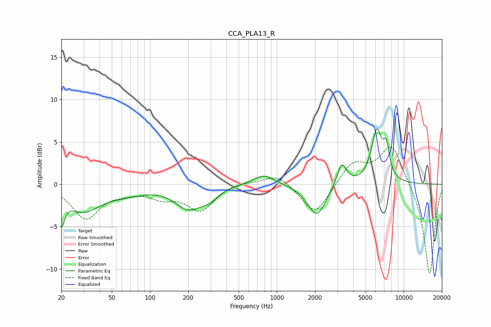

# CCA_PLA13_R
See [usage instructions](https://github.com/jaakkopasanen/AutoEq#usage) for more options and info.

### Parametric EQs
Apply preamp of -6.6 dB when using parametric equalizer.

|   # | Type    |   Fc (Hz) |    Q |   Gain (dB) |
|-----|---------|-----------|------|-------------|
|   1 | Peaking |        20 | 5.98 |        -3.3 |
|   2 | Peaking |        30 | 1.06 |        -2.9 |
|   3 | Peaking |        64 | 0.92 |        -0.8 |
|   4 | Peaking |       200 | 1.35 |        -2.6 |
|   5 | Peaking |       290 | 2.05 |        -1.1 |
|   6 | Peaking |       790 | 1.65 |         1.3 |
|   7 | Peaking |      2063 | 1.96 |        -3.8 |
|   8 | Peaking |      3249 | 3.68 |         2.8 |
|   9 | Peaking |      6116 | 3.22 |         6   |
|  10 | Peaking |      7294 | 5.5  |         3.1 |

### Fixed Band EQs
When using fixed band (also called graphic) equalizer, apply preamp of **-4.5 dB** (if available) and set gains manually with these parameters.

|   # | Type    |   Fc (Hz) |    Q |   Gain (dB) |
|-----|---------|-----------|------|-------------|
|   1 | Peaking |        31 | 1.41 |        -3.9 |
|   2 | Peaking |        62 | 1.41 |        -0.6 |
|   3 | Peaking |       125 | 1.41 |        -1.3 |
|   4 | Peaking |       250 | 1.41 |        -3   |
|   5 | Peaking |       500 | 1.41 |         0.4 |
|   6 | Peaking |      1000 | 1.41 |         1.3 |
|   7 | Peaking |      2000 | 1.41 |        -3.7 |
|   8 | Peaking |      4000 | 1.41 |         2.6 |
|   9 | Peaking |      8000 | 1.41 |         4.7 |
|  10 | Peaking |     16000 | 1.41 |       -10.8 |

### Graphs

