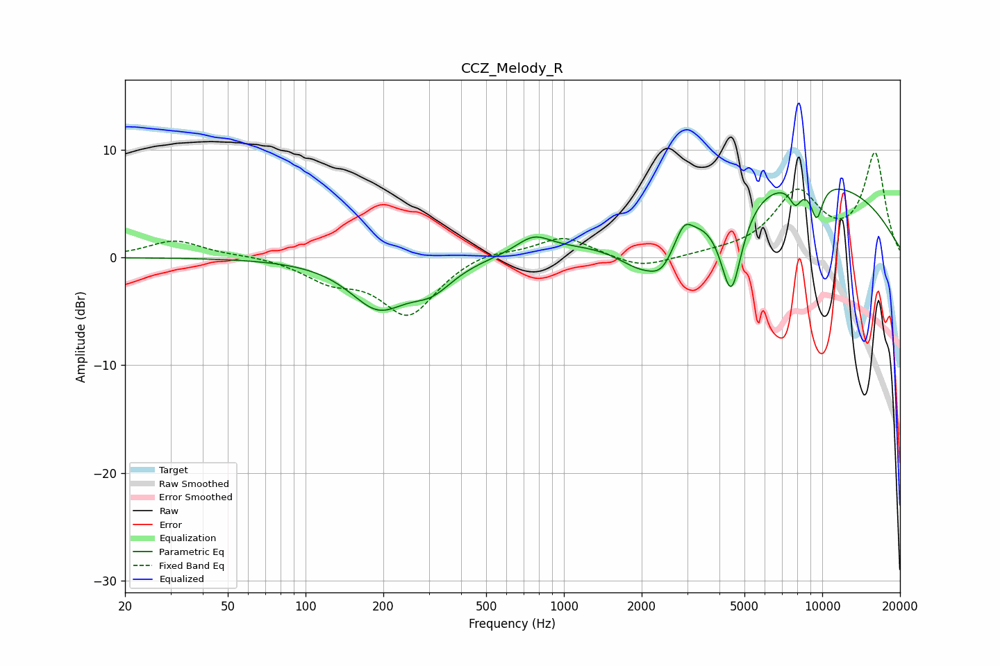

# CCZ_Melody_R
See [usage instructions](https://github.com/jaakkopasanen/AutoEq#usage) for more options and info.

### Parametric EQs
Apply preamp of -6.4 dB when using parametric equalizer.

|   # | Type    |   Fc (Hz) |    Q |   Gain (dB) |
|-----|---------|-----------|------|-------------|
|   1 | Peaking |       191 | 1.28 |        -4.4 |
|   2 | Peaking |       308 | 1.67 |        -2.2 |
|   3 | Peaking |       763 | 2.12 |         1.6 |
|   4 | Peaking |      2090 | 1.18 |        -4.9 |
|   5 | Peaking |      2409 | 3.22 |        -1.6 |
|   6 | Peaking |      2915 | 4.75 |         1.5 |
|   7 | Peaking |      4442 | 3.22 |        -8.9 |
|   8 | Peaking |      7094 | 0.23 |         7.7 |
|   9 | Peaking |      7877 | 5.72 |        -1.8 |
|  10 | Peaking |      9523 | 5.27 |        -3.2 |

### Fixed Band EQs
When using fixed band (also called graphic) equalizer, apply preamp of **-9.8 dB** (if available) and set gains manually with these parameters.

|   # | Type    |   Fc (Hz) |    Q |   Gain (dB) |
|-----|---------|-----------|------|-------------|
|   1 | Peaking |        31 | 1.41 |         1.6 |
|   2 | Peaking |        62 | 1.41 |         0.2 |
|   3 | Peaking |       125 | 1.41 |        -1.8 |
|   4 | Peaking |       250 | 1.41 |        -5.2 |
|   5 | Peaking |       500 | 1.41 |         0.7 |
|   6 | Peaking |      1000 | 1.41 |         2   |
|   7 | Peaking |      2000 | 1.41 |        -1.1 |
|   8 | Peaking |      4000 | 1.41 |         0.2 |
|   9 | Peaking |      8000 | 1.41 |         5.8 |
|  10 | Peaking |     16000 | 1.41 |         9.5 |

### Graphs

