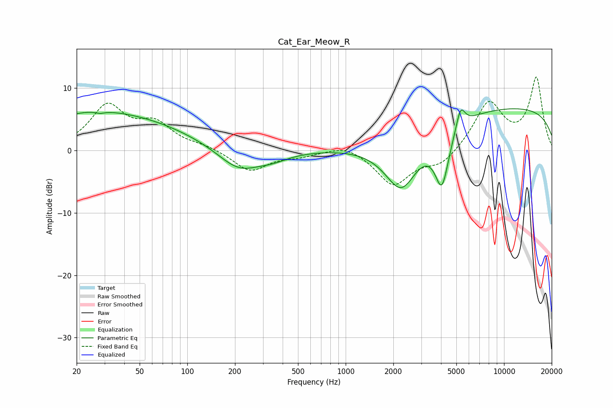

# Cat_Ear_Meow_R
See [usage instructions](https://github.com/jaakkopasanen/AutoEq#usage) for more options and info.

### Parametric EQs
Apply preamp of -6.8 dB when using parametric equalizer.

|   # | Type    |   Fc (Hz) |    Q |   Gain (dB) |
|-----|---------|-----------|------|-------------|
|   1 | Peaking |        24 | 0.9  |         0.5 |
|   2 | Peaking |        28 | 5.54 |        -3.4 |
|   3 | Peaking |        28 | 5.61 |         3.1 |
|   4 | Peaking |        31 | 0.29 |         5.9 |
|   5 | Peaking |       211 | 1.05 |        -3.7 |
|   6 | Peaking |       347 | 1.37 |        -1   |
|   7 | Peaking |      2248 | 1.27 |        -9   |
|   8 | Peaking |      4054 | 3.08 |        -8.9 |
|   9 | Peaking |      5314 | 4.95 |         3.5 |
|  10 | Peaking |     10000 | 0.18 |         6.9 |

### Fixed Band EQs
When using fixed band (also called graphic) equalizer, apply preamp of **-11.8 dB** (if available) and set gains manually with these parameters.

|   # | Type    |   Fc (Hz) |    Q |   Gain (dB) |
|-----|---------|-----------|------|-------------|
|   1 | Peaking |        31 | 1.41 |         6.9 |
|   2 | Peaking |        62 | 1.41 |         3.8 |
|   3 | Peaking |       125 | 1.41 |         0.6 |
|   4 | Peaking |       250 | 1.41 |        -3.3 |
|   5 | Peaking |       500 | 1.41 |        -0.7 |
|   6 | Peaking |      1000 | 1.41 |         1.2 |
|   7 | Peaking |      2000 | 1.41 |        -5.5 |
|   8 | Peaking |      4000 | 1.41 |        -2.3 |
|   9 | Peaking |      8000 | 1.41 |         7.6 |
|  10 | Peaking |     16000 | 1.41 |        11.4 |

### Graphs

