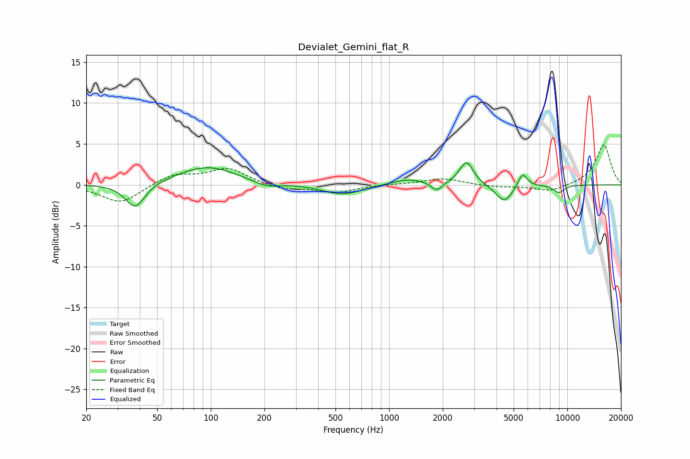

# Devialet_Gemini_flat_R
See [usage instructions](https://github.com/jaakkopasanen/AutoEq#usage) for more options and info.

### Parametric EQs
Apply preamp of -2.8 dB when using parametric equalizer.

|   # | Type    |   Fc (Hz) |    Q |   Gain (dB) |
|-----|---------|-----------|------|-------------|
|   1 | Peaking |        38 | 2.57 |        -3.1 |
|   2 | Peaking |        96 | 0.83 |         2.3 |
|   3 | Peaking |       203 | 1.92 |        -0.7 |
|   4 | Peaking |       548 | 1.29 |        -1.2 |
|   5 | Peaking |      1283 | 1.45 |         0.8 |
|   6 | Peaking |      1850 | 4.62 |        -1.1 |
|   7 | Peaking |      2713 | 3.67 |         2.9 |
|   8 | Peaking |      4436 | 2.95 |        -2.2 |
|   9 | Peaking |      5601 | 5.17 |         1.8 |
|  10 | Peaking |      8964 | 4.35 |        -0.9 |

### Fixed Band EQs
When using fixed band (also called graphic) equalizer, apply preamp of **-5.0 dB** (if available) and set gains manually with these parameters.

|   # | Type    |   Fc (Hz) |    Q |   Gain (dB) |
|-----|---------|-----------|------|-------------|
|   1 | Peaking |        31 | 1.41 |        -2.3 |
|   2 | Peaking |        62 | 1.41 |         1.3 |
|   3 | Peaking |       125 | 1.41 |         2   |
|   4 | Peaking |       250 | 1.41 |        -0.6 |
|   5 | Peaking |       500 | 1.41 |        -0.9 |
|   6 | Peaking |      1000 | 1.41 |         0.1 |
|   7 | Peaking |      2000 | 1.41 |         0.8 |
|   8 | Peaking |      4000 | 1.41 |        -0.3 |
|   9 | Peaking |      8000 | 1.41 |        -0.8 |
|  10 | Peaking |     16000 | 1.41 |         4.9 |

### Graphs

