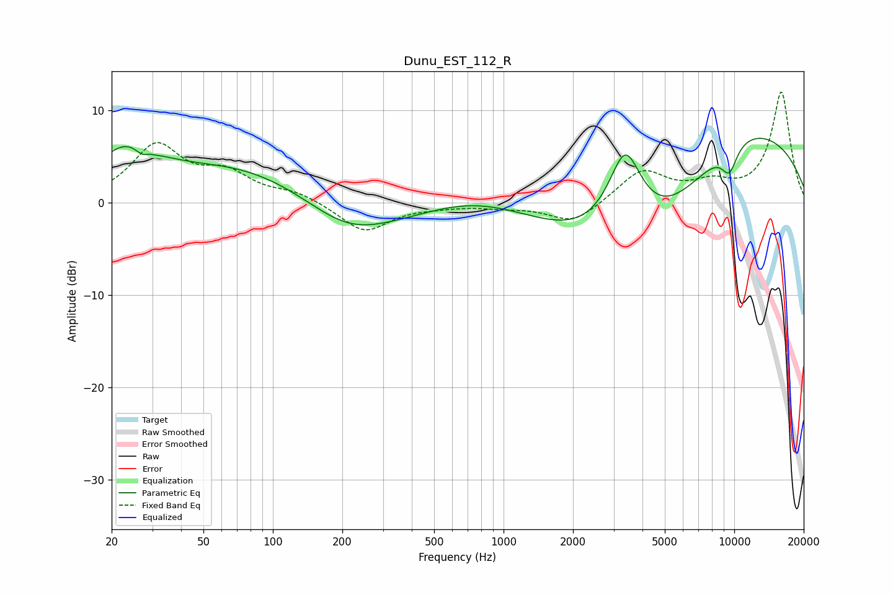

# Dunu_EST_112_R
See [usage instructions](https://github.com/jaakkopasanen/AutoEq#usage) for more options and info.

### Parametric EQs
Apply preamp of -7.0 dB when using parametric equalizer.

|   # | Type    |   Fc (Hz) |    Q |   Gain (dB) |
|-----|---------|-----------|------|-------------|
|   1 | Peaking |        23 | 1.1  |         4.7 |
|   2 | Peaking |        28 | 4.25 |        -1.7 |
|   3 | Peaking |        29 | 5.98 |         0.8 |
|   4 | Peaking |       213 | 0.18 |         7.3 |
|   5 | Peaking |       213 | 0.56 |        -7.9 |
|   6 | Peaking |       430 | 0.61 |        -2.6 |
|   7 | Peaking |      3367 | 1.79 |         9.8 |
|   8 | Peaking |      4319 | 0.34 |       -12.9 |
|   9 | Peaking |      9392 | 0.32 |        13.8 |
|  10 | Peaking |      9526 | 3.66 |        -2.8 |

### Fixed Band EQs
When using fixed band (also called graphic) equalizer, apply preamp of **-12.0 dB** (if available) and set gains manually with these parameters.

|   # | Type    |   Fc (Hz) |    Q |   Gain (dB) |
|-----|---------|-----------|------|-------------|
|   1 | Peaking |        31 | 1.41 |         6   |
|   2 | Peaking |        62 | 1.41 |         2.7 |
|   3 | Peaking |       125 | 1.41 |         1   |
|   4 | Peaking |       250 | 1.41 |        -3.2 |
|   5 | Peaking |       500 | 1.41 |        -0.3 |
|   6 | Peaking |      1000 | 1.41 |        -0.4 |
|   7 | Peaking |      2000 | 1.41 |        -2.3 |
|   8 | Peaking |      4000 | 1.41 |         3.4 |
|   9 | Peaking |      8000 | 1.41 |         1.7 |
|  10 | Peaking |     16000 | 1.41 |        11.9 |

### Graphs

