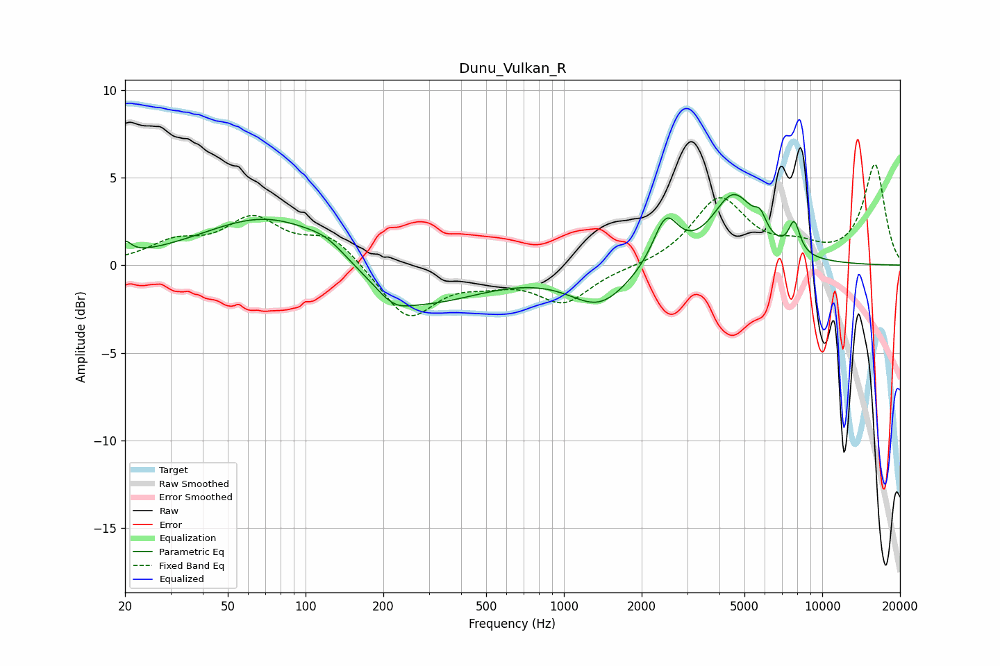

# Dunu_Vulkan_R
See [usage instructions](https://github.com/jaakkopasanen/AutoEq#usage) for more options and info.

### Parametric EQs
Apply preamp of -4.1 dB when using parametric equalizer.

|   # | Type    |   Fc (Hz) |    Q |   Gain (dB) |
|-----|---------|-----------|------|-------------|
|   1 | Peaking |        20 | 5.9  |         0.7 |
|   2 | Peaking |        75 | 0.55 |         3   |
|   3 | Peaking |       121 | 1.91 |         0.6 |
|   4 | Peaking |       220 | 2.16 |        -0.8 |
|   5 | Peaking |       265 | 0.58 |        -2.5 |
|   6 | Peaking |      1376 | 1.21 |        -2.2 |
|   7 | Peaking |      2481 | 2.89 |         2.7 |
|   8 | Peaking |      4541 | 1.65 |         3.9 |
|   9 | Peaking |      5758 | 6    |         0.9 |
|  10 | Peaking |      7793 | 5.97 |         1.8 |

### Fixed Band EQs
When using fixed band (also called graphic) equalizer, apply preamp of **-5.8 dB** (if available) and set gains manually with these parameters.

|   # | Type    |   Fc (Hz) |    Q |   Gain (dB) |
|-----|---------|-----------|------|-------------|
|   1 | Peaking |        31 | 1.41 |         1.1 |
|   2 | Peaking |        62 | 1.41 |         2.4 |
|   3 | Peaking |       125 | 1.41 |         1.6 |
|   4 | Peaking |       250 | 1.41 |        -3.1 |
|   5 | Peaking |       500 | 1.41 |        -0.6 |
|   6 | Peaking |      1000 | 1.41 |        -2   |
|   7 | Peaking |      2000 | 1.41 |        -0.1 |
|   8 | Peaking |      4000 | 1.41 |         3.8 |
|   9 | Peaking |      8000 | 1.41 |         0.8 |
|  10 | Peaking |     16000 | 1.41 |         5.7 |

### Graphs

