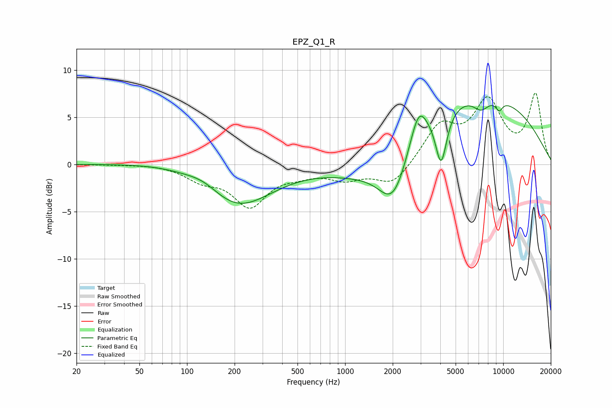

# EPZ_Q1_R
See [usage instructions](https://github.com/jaakkopasanen/AutoEq#usage) for more options and info.

### Parametric EQs
Apply preamp of -6.3 dB when using parametric equalizer.

|   # | Type    |   Fc (Hz) |    Q |   Gain (dB) |
|-----|---------|-----------|------|-------------|
|   1 | Peaking |        79 | 0.61 |         0.5 |
|   2 | Peaking |       128 | 1.3  |         1   |
|   3 | Peaking |       205 | 0.64 |        -4.6 |
|   4 | Peaking |      1284 | 0.67 |        -1.8 |
|   5 | Peaking |      2024 | 1.42 |        -6.1 |
|   6 | Peaking |      2913 | 2.71 |         3.5 |
|   7 | Peaking |      4049 | 3.91 |        -5.7 |
|   8 | Peaking |      6651 | 0.28 |         7.7 |
|   9 | Peaking |      7247 | 2.66 |        -1.4 |
|  10 | Peaking |      9428 | 5.87 |        -1   |

### Fixed Band EQs
When using fixed band (also called graphic) equalizer, apply preamp of **-7.7 dB** (if available) and set gains manually with these parameters.

|   # | Type    |   Fc (Hz) |    Q |   Gain (dB) |
|-----|---------|-----------|------|-------------|
|   1 | Peaking |        31 | 1.41 |        -0   |
|   2 | Peaking |        62 | 1.41 |         0.1 |
|   3 | Peaking |       125 | 1.41 |        -1.4 |
|   4 | Peaking |       250 | 1.41 |        -4.2 |
|   5 | Peaking |       500 | 1.41 |        -0.7 |
|   6 | Peaking |      1000 | 1.41 |        -1.4 |
|   7 | Peaking |      2000 | 1.41 |        -2.3 |
|   8 | Peaking |      4000 | 1.41 |         3.9 |
|   9 | Peaking |      8000 | 1.41 |         6.3 |
|  10 | Peaking |     16000 | 1.41 |         7.2 |

### Graphs

