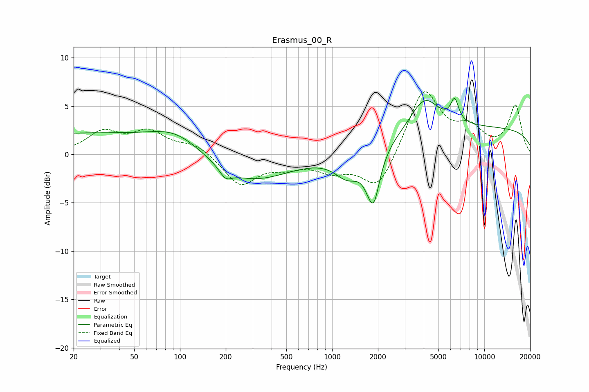

# Erasmus_00_R
See [usage instructions](https://github.com/jaakkopasanen/AutoEq#usage) for more options and info.

### Parametric EQs
Apply preamp of -5.9 dB when using parametric equalizer.

|   # | Type    |   Fc (Hz) |    Q |   Gain (dB) |
|-----|---------|-----------|------|-------------|
|   1 | Peaking |        20 | 0.24 |         2.1 |
|   2 | Peaking |        95 | 0.82 |         2   |
|   3 | Peaking |       199 | 3.59 |        -1   |
|   4 | Peaking |       286 | 0.55 |        -2.9 |
|   5 | Peaking |      1267 | 1.65 |        -2.4 |
|   6 | Peaking |      1821 | 5.36 |         1.2 |
|   7 | Peaking |      1849 | 3.44 |        -6.7 |
|   8 | Peaking |      4044 | 1.47 |         3.6 |
|   9 | Peaking |      6387 | 5.26 |         2.3 |
|  10 | Peaking |     10000 | 0.18 |         2.7 |

### Fixed Band EQs
When using fixed band (also called graphic) equalizer, apply preamp of **-6.6 dB** (if available) and set gains manually with these parameters.

|   # | Type    |   Fc (Hz) |    Q |   Gain (dB) |
|-----|---------|-----------|------|-------------|
|   1 | Peaking |        31 | 1.41 |         2.2 |
|   2 | Peaking |        62 | 1.41 |         2.1 |
|   3 | Peaking |       125 | 1.41 |         1.1 |
|   4 | Peaking |       250 | 1.41 |        -3.1 |
|   5 | Peaking |       500 | 1.41 |        -1   |
|   6 | Peaking |      1000 | 1.41 |        -1.5 |
|   7 | Peaking |      2000 | 1.41 |        -3.8 |
|   8 | Peaking |      4000 | 1.41 |         6.8 |
|   9 | Peaking |      8000 | 1.41 |         2.3 |
|  10 | Peaking |     16000 | 1.41 |         5   |

### Graphs

