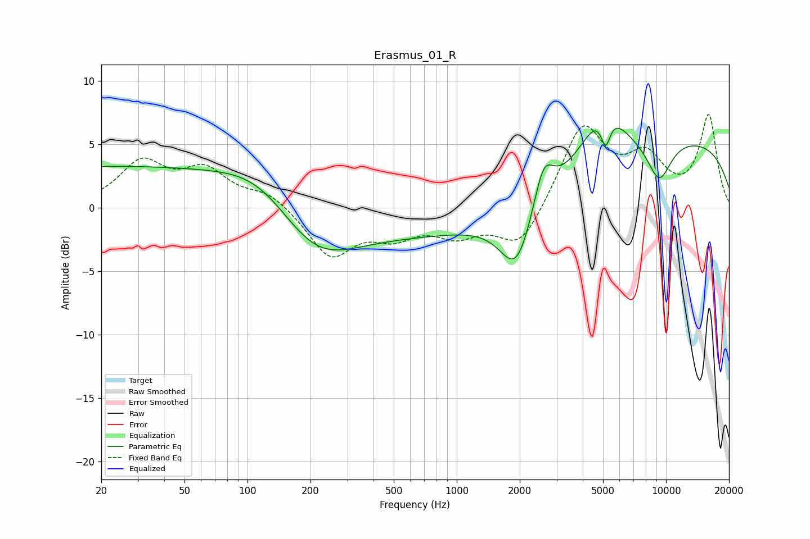

# Erasmus_01_R
See [usage instructions](https://github.com/jaakkopasanen/AutoEq#usage) for more options and info.

### Parametric EQs
Apply preamp of -6.4 dB when using parametric equalizer.

|   # | Type    |   Fc (Hz) |    Q |   Gain (dB) |
|-----|---------|-----------|------|-------------|
|   1 | Peaking |        20 | 0.18 |         3.2 |
|   2 | Peaking |       119 | 0.72 |         2.5 |
|   3 | Peaking |       206 | 0.72 |        -4.1 |
|   4 | Peaking |      1313 | 0.19 |        -2.2 |
|   5 | Peaking |      1931 | 1.8  |        -4.9 |
|   6 | Peaking |      2598 | 2.98 |         3.5 |
|   7 | Peaking |      5014 | 1.36 |         4.4 |
|   8 | Peaking |      5147 | 5.95 |        -2.5 |
|   9 | Peaking |      9277 | 2.14 |        -3.3 |
|  10 | Peaking |     10000 | 0.21 |         5.6 |

### Fixed Band EQs
When using fixed band (also called graphic) equalizer, apply preamp of **-7.4 dB** (if available) and set gains manually with these parameters.

|   # | Type    |   Fc (Hz) |    Q |   Gain (dB) |
|-----|---------|-----------|------|-------------|
|   1 | Peaking |        31 | 1.41 |         3.4 |
|   2 | Peaking |        62 | 1.41 |         2.7 |
|   3 | Peaking |       125 | 1.41 |         1.2 |
|   4 | Peaking |       250 | 1.41 |        -3.8 |
|   5 | Peaking |       500 | 1.41 |        -1.8 |
|   6 | Peaking |      1000 | 1.41 |        -1.8 |
|   7 | Peaking |      2000 | 1.41 |        -3.3 |
|   8 | Peaking |      4000 | 1.41 |         6.5 |
|   9 | Peaking |      8000 | 1.41 |         3.5 |
|  10 | Peaking |     16000 | 1.41 |         7.1 |

### Graphs

