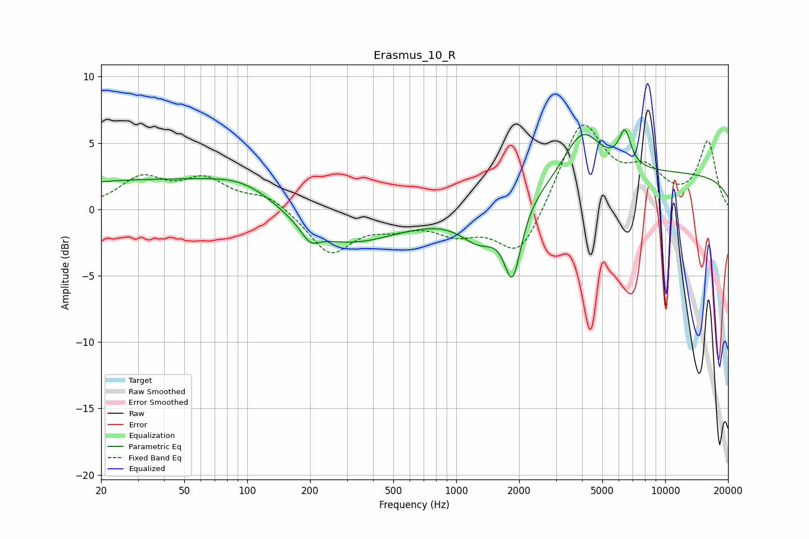

# Erasmus_10_R
See [usage instructions](https://github.com/jaakkopasanen/AutoEq#usage) for more options and info.

### Parametric EQs
Apply preamp of -6.1 dB when using parametric equalizer.

|   # | Type    |   Fc (Hz) |    Q |   Gain (dB) |
|-----|---------|-----------|------|-------------|
|   1 | Peaking |        35 | 0.21 |         2.2 |
|   2 | Peaking |        99 | 0.83 |         1.4 |
|   3 | Peaking |       200 | 3.37 |        -1.1 |
|   4 | Peaking |       270 | 0.52 |        -3.1 |
|   5 | Peaking |      1303 | 1.5  |        -2.5 |
|   6 | Peaking |      1861 | 3.47 |        -5.3 |
|   7 | Peaking |      4014 | 1.59 |         3.7 |
|   8 | Peaking |      6300 | 5.86 |        -0.9 |
|   9 | Peaking |      6382 | 5.02 |         3.4 |
|  10 | Peaking |     10000 | 0.18 |         2.7 |

### Fixed Band EQs
When using fixed band (also called graphic) equalizer, apply preamp of **-6.5 dB** (if available) and set gains manually with these parameters.

|   # | Type    |   Fc (Hz) |    Q |   Gain (dB) |
|-----|---------|-----------|------|-------------|
|   1 | Peaking |        31 | 1.41 |         2.2 |
|   2 | Peaking |        62 | 1.41 |         2   |
|   3 | Peaking |       125 | 1.41 |         1.1 |
|   4 | Peaking |       250 | 1.41 |        -3.3 |
|   5 | Peaking |       500 | 1.41 |        -1   |
|   6 | Peaking |      1000 | 1.41 |        -1.5 |
|   7 | Peaking |      2000 | 1.41 |        -3.8 |
|   8 | Peaking |      4000 | 1.41 |         6.6 |
|   9 | Peaking |      8000 | 1.41 |         2.4 |
|  10 | Peaking |     16000 | 1.41 |         5   |

### Graphs

