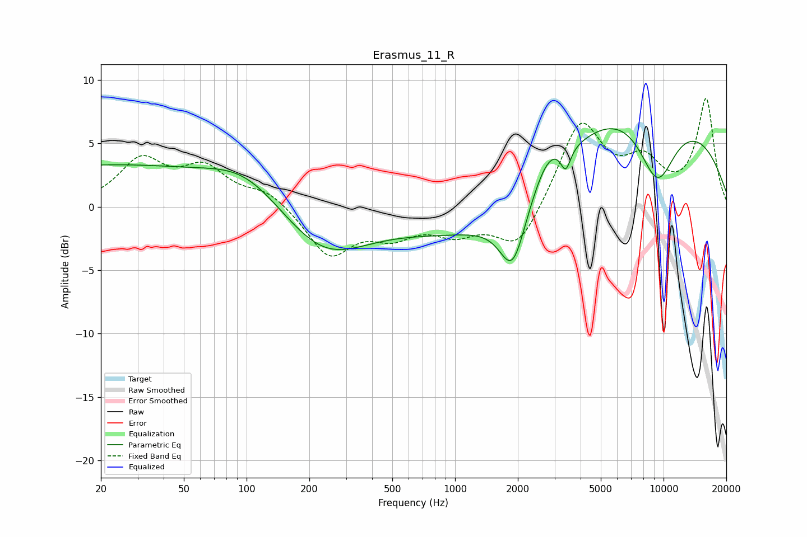

# Erasmus_11_R
See [usage instructions](https://github.com/jaakkopasanen/AutoEq#usage) for more options and info.

### Parametric EQs
Apply preamp of -6.3 dB when using parametric equalizer.

|   # | Type    |   Fc (Hz) |    Q |   Gain (dB) |
|-----|---------|-----------|------|-------------|
|   1 | Peaking |        20 | 0.24 |         3.2 |
|   2 | Peaking |       100 | 0.77 |         2.3 |
|   3 | Peaking |       235 | 0.68 |        -3.8 |
|   4 | Peaking |      1891 | 2.26 |        -4.9 |
|   5 | Peaking |      2800 | 1.76 |         2.4 |
|   6 | Peaking |      2956 | 0.21 |        -3.5 |
|   7 | Peaking |      3394 | 5.97 |        -1.8 |
|   8 | Peaking |      5581 | 0.49 |         4.5 |
|   9 | Peaking |      9321 | 1.36 |        -5.7 |
|  10 | Peaking |      9619 | 0.28 |         7.3 |

### Fixed Band EQs
When using fixed band (also called graphic) equalizer, apply preamp of **-8.6 dB** (if available) and set gains manually with these parameters.

|   # | Type    |   Fc (Hz) |    Q |   Gain (dB) |
|-----|---------|-----------|------|-------------|
|   1 | Peaking |        31 | 1.41 |         3.5 |
|   2 | Peaking |        62 | 1.41 |         2.8 |
|   3 | Peaking |       125 | 1.41 |         1.2 |
|   4 | Peaking |       250 | 1.41 |        -3.8 |
|   5 | Peaking |       500 | 1.41 |        -1.9 |
|   6 | Peaking |      1000 | 1.41 |        -1.8 |
|   7 | Peaking |      2000 | 1.41 |        -3.4 |
|   8 | Peaking |      4000 | 1.41 |         6.7 |
|   9 | Peaking |      8000 | 1.41 |         3   |
|  10 | Peaking |     16000 | 1.41 |         8.4 |

### Graphs

