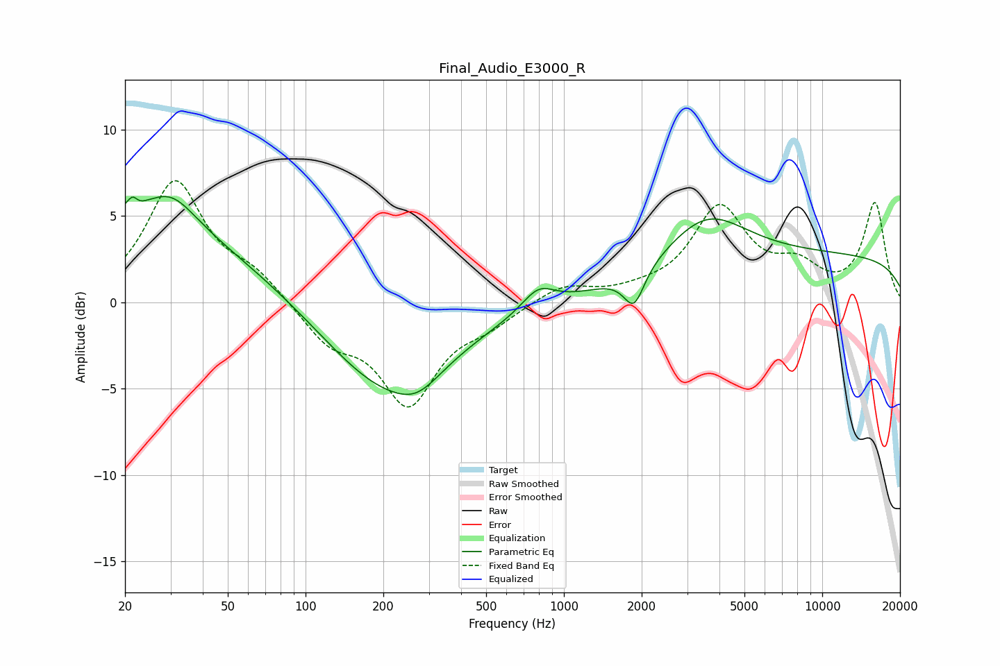

# Final_Audio_E3000_R
See [usage instructions](https://github.com/jaakkopasanen/AutoEq#usage) for more options and info.

### Parametric EQs
Apply preamp of -6.2 dB when using parametric equalizer.

|   # | Type    |   Fc (Hz) |    Q |   Gain (dB) |
|-----|---------|-----------|------|-------------|
|   1 | Peaking |        20 | 0.28 |         4.7 |
|   2 | Peaking |        22 | 5.9  |         3   |
|   3 | Peaking |        22 | 6    |        -2.5 |
|   4 | Peaking |        30 | 1.46 |         2   |
|   5 | Peaking |       209 | 0.58 |        -5.1 |
|   6 | Peaking |       271 | 1.71 |        -0.9 |
|   7 | Peaking |       796 | 2.21 |         1.3 |
|   8 | Peaking |      1869 | 3.56 |        -2.1 |
|   9 | Peaking |      3551 | 0.92 |         2.9 |
|  10 | Peaking |     10000 | 0.18 |         2.7 |

### Fixed Band EQs
When using fixed band (also called graphic) equalizer, apply preamp of **-7.1 dB** (if available) and set gains manually with these parameters.

|   # | Type    |   Fc (Hz) |    Q |   Gain (dB) |
|-----|---------|-----------|------|-------------|
|   1 | Peaking |        31 | 1.41 |         6.9 |
|   2 | Peaking |        62 | 1.41 |         1.4 |
|   3 | Peaking |       125 | 1.41 |        -2.1 |
|   4 | Peaking |       250 | 1.41 |        -5.7 |
|   5 | Peaking |       500 | 1.41 |        -1   |
|   6 | Peaking |      1000 | 1.41 |         1   |
|   7 | Peaking |      2000 | 1.41 |         0.4 |
|   8 | Peaking |      4000 | 1.41 |         5.3 |
|   9 | Peaking |      8000 | 1.41 |         1.7 |
|  10 | Peaking |     16000 | 1.41 |         5.7 |

### Graphs

