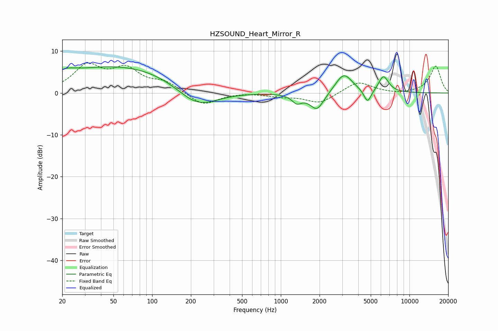

# HZSOUND_Heart_Mirror_R
See [usage instructions](https://github.com/jaakkopasanen/AutoEq#usage) for more options and info.

### Parametric EQs
Apply preamp of -6.3 dB when using parametric equalizer.

|   # | Type    |   Fc (Hz) |    Q |   Gain (dB) |
|-----|---------|-----------|------|-------------|
|   1 | Peaking |        21 | 1.82 |         1.4 |
|   2 | Peaking |        61 | 0.27 |         6.6 |
|   3 | Peaking |       223 | 0.84 |        -5.7 |
|   4 | Peaking |      1330 | 3.85 |        -1.9 |
|   5 | Peaking |      1834 | 3.1  |         1.5 |
|   6 | Peaking |      1887 | 2.59 |        -5.7 |
|   7 | Peaking |      3087 | 2.12 |         4.8 |
|   8 | Peaking |      4721 | 5.02 |        -3.2 |
|   9 | Peaking |      5851 | 2.59 |        -0.8 |
|  10 | Peaking |      6245 | 3.32 |         4.6 |

### Fixed Band EQs
When using fixed band (also called graphic) equalizer, apply preamp of **-7.3 dB** (if available) and set gains manually with these parameters.

|   # | Type    |   Fc (Hz) |    Q |   Gain (dB) |
|-----|---------|-----------|------|-------------|
|   1 | Peaking |        31 | 1.41 |         6.1 |
|   2 | Peaking |        62 | 1.41 |         5.1 |
|   3 | Peaking |       125 | 1.41 |         2.3 |
|   4 | Peaking |       250 | 1.41 |        -3.1 |
|   5 | Peaking |       500 | 1.41 |         0.2 |
|   6 | Peaking |      1000 | 1.41 |        -0.7 |
|   7 | Peaking |      2000 | 1.41 |        -2.5 |
|   8 | Peaking |      4000 | 1.41 |         2.8 |
|   9 | Peaking |      8000 | 1.41 |        -0.3 |
|  10 | Peaking |     16000 | 1.41 |         6.5 |

### Graphs

