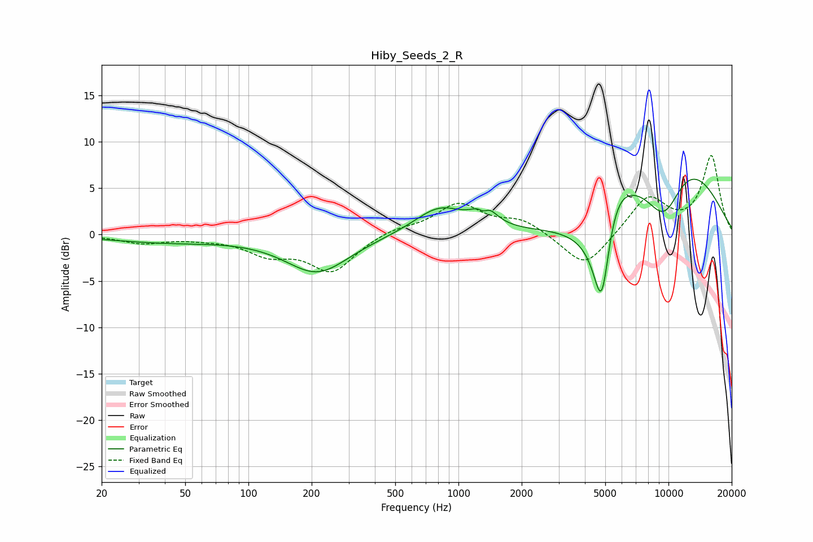

# Hiby_Seeds_2_R
See [usage instructions](https://github.com/jaakkopasanen/AutoEq#usage) for more options and info.

### Parametric EQs
Apply preamp of -6.1 dB when using parametric equalizer.

|   # | Type    |   Fc (Hz) |    Q |   Gain (dB) |
|-----|---------|-----------|------|-------------|
|   1 | Peaking |        40 | 0.51 |        -0.8 |
|   2 | Peaking |       213 | 0.93 |        -4.1 |
|   3 | Peaking |       813 | 1.18 |         2.9 |
|   4 | Peaking |      1318 | 5.35 |        -1.8 |
|   5 | Peaking |      1329 | 3.26 |         3.1 |
|   6 | Peaking |      4817 | 1.9  |       -20   |
|   7 | Peaking |      5303 | 1.31 |        11.1 |
|   8 | Peaking |      9534 | 0.87 |       -13.6 |
|   9 | Peaking |     10000 | 0.54 |         7.8 |
|  10 | Peaking |     10000 | 0.47 |         8.6 |

### Fixed Band EQs
When using fixed band (also called graphic) equalizer, apply preamp of **-8.6 dB** (if available) and set gains manually with these parameters.

|   # | Type    |   Fc (Hz) |    Q |   Gain (dB) |
|-----|---------|-----------|------|-------------|
|   1 | Peaking |        31 | 1.41 |        -0.9 |
|   2 | Peaking |        62 | 1.41 |        -0.3 |
|   3 | Peaking |       125 | 1.41 |        -1.9 |
|   4 | Peaking |       250 | 1.41 |        -3.9 |
|   5 | Peaking |       500 | 1.41 |         0.7 |
|   6 | Peaking |      1000 | 1.41 |         3.2 |
|   7 | Peaking |      2000 | 1.41 |         1.5 |
|   8 | Peaking |      4000 | 1.41 |        -3.8 |
|   9 | Peaking |      8000 | 1.41 |         4   |
|  10 | Peaking |     16000 | 1.41 |         8.4 |

### Graphs

