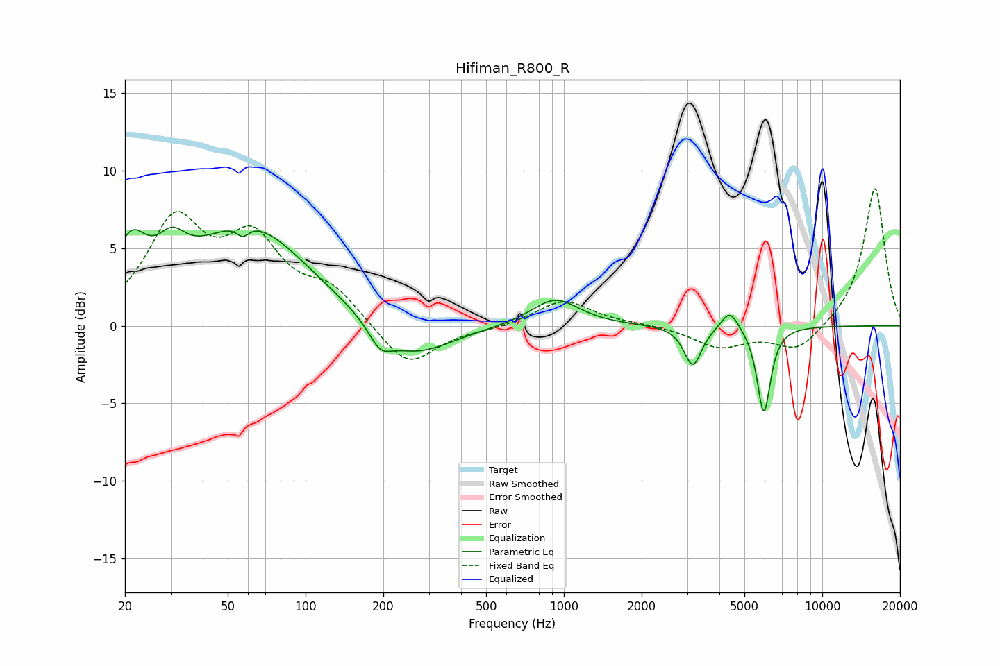

# Hifiman_R800_R
See [usage instructions](https://github.com/jaakkopasanen/AutoEq#usage) for more options and info.

### Parametric EQs
Apply preamp of -6.4 dB when using parametric equalizer.

|   # | Type    |   Fc (Hz) |    Q |   Gain (dB) |
|-----|---------|-----------|------|-------------|
|   1 | Peaking |        21 | 2.25 |         3.9 |
|   2 | Peaking |        30 | 2.6  |         2   |
|   3 | Peaking |        57 | 5.97 |        -0.7 |
|   4 | Peaking |        60 | 0.63 |         6.3 |
|   5 | Peaking |       195 | 3.24 |        -1.3 |
|   6 | Peaking |       261 | 0.96 |        -2.3 |
|   7 | Peaking |       924 | 1.54 |         1.8 |
|   8 | Peaking |      3156 | 4.24 |        -2.6 |
|   9 | Peaking |      4390 | 4.19 |         1.3 |
|  10 | Peaking |      5943 | 5.41 |        -5.6 |

### Fixed Band EQs
When using fixed band (also called graphic) equalizer, apply preamp of **-8.9 dB** (if available) and set gains manually with these parameters.

|   # | Type    |   Fc (Hz) |    Q |   Gain (dB) |
|-----|---------|-----------|------|-------------|
|   1 | Peaking |        31 | 1.41 |         6.4 |
|   2 | Peaking |        62 | 1.41 |         4.9 |
|   3 | Peaking |       125 | 1.41 |         2.1 |
|   4 | Peaking |       250 | 1.41 |        -2.8 |
|   5 | Peaking |       500 | 1.41 |        -0.2 |
|   6 | Peaking |      1000 | 1.41 |         1.7 |
|   7 | Peaking |      2000 | 1.41 |         0.1 |
|   8 | Peaking |      4000 | 1.41 |        -1.3 |
|   9 | Peaking |      8000 | 1.41 |        -1.7 |
|  10 | Peaking |     16000 | 1.41 |         9   |

### Graphs

