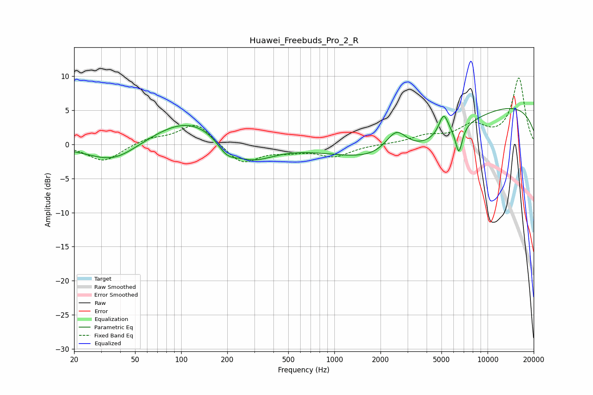

# Huawei_Freebuds_Pro_2_R
See [usage instructions](https://github.com/jaakkopasanen/AutoEq#usage) for more options and info.

### Parametric EQs
Apply preamp of -5.3 dB when using parametric equalizer.

|   # | Type    |   Fc (Hz) |    Q |   Gain (dB) |
|-----|---------|-----------|------|-------------|
|   1 | Peaking |        20 | 2.76 |        -0.1 |
|   2 | Peaking |        36 | 0.86 |        -2.9 |
|   3 | Peaking |       114 | 0.58 |         4   |
|   4 | Peaking |       198 | 2.2  |        -2   |
|   5 | Peaking |       285 | 0.97 |        -3.1 |
|   6 | Peaking |      2537 | 1.95 |         3.7 |
|   7 | Peaking |      3000 | 0.41 |        -6   |
|   8 | Peaking |      5165 | 4.44 |         3.2 |
|   9 | Peaking |      6495 | 6    |        -4   |
|  10 | Peaking |      9712 | 0.19 |         6.3 |

### Fixed Band EQs
When using fixed band (also called graphic) equalizer, apply preamp of **-9.8 dB** (if available) and set gains manually with these parameters.

|   # | Type    |   Fc (Hz) |    Q |   Gain (dB) |
|-----|---------|-----------|------|-------------|
|   1 | Peaking |        31 | 1.41 |        -2.5 |
|   2 | Peaking |        62 | 1.41 |         0.9 |
|   3 | Peaking |       125 | 1.41 |         3.2 |
|   4 | Peaking |       250 | 1.41 |        -2.9 |
|   5 | Peaking |       500 | 1.41 |        -0.8 |
|   6 | Peaking |      1000 | 1.41 |        -1.7 |
|   7 | Peaking |      2000 | 1.41 |         0   |
|   8 | Peaking |      4000 | 1.41 |         1.1 |
|   9 | Peaking |      8000 | 1.41 |         2.5 |
|  10 | Peaking |     16000 | 1.41 |         9.6 |

### Graphs

