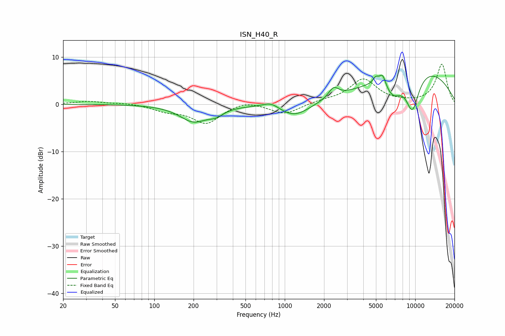

# ISN_H40_R
See [usage instructions](https://github.com/jaakkopasanen/AutoEq#usage) for more options and info.

### Parametric EQs
Apply preamp of -6.3 dB when using parametric equalizer.

|   # | Type    |   Fc (Hz) |    Q |   Gain (dB) |
|-----|---------|-----------|------|-------------|
|   1 | Peaking |       200 | 1.34 |        -3.5 |
|   2 | Peaking |       297 | 2.4  |        -1.3 |
|   3 | Peaking |       784 | 2.17 |         1.3 |
|   4 | Peaking |      1184 | 1.16 |        -3   |
|   5 | Peaking |      2367 | 3.77 |         2.1 |
|   6 | Peaking |      4991 | 5.99 |         1.4 |
|   7 | Peaking |      5629 | 5.66 |         2.5 |
|   8 | Peaking |      6756 | 2    |        -3.9 |
|   9 | Peaking |      9504 | 2.3  |        -8.3 |
|  10 | Peaking |     10000 | 0.34 |         8.1 |

### Fixed Band EQs
When using fixed band (also called graphic) equalizer, apply preamp of **-8.6 dB** (if available) and set gains manually with these parameters.

|   # | Type    |   Fc (Hz) |    Q |   Gain (dB) |
|-----|---------|-----------|------|-------------|
|   1 | Peaking |        31 | 1.41 |         0.6 |
|   2 | Peaking |        62 | 1.41 |         0.3 |
|   3 | Peaking |       125 | 1.41 |        -1.2 |
|   4 | Peaking |       250 | 1.41 |        -3.9 |
|   5 | Peaking |       500 | 1.41 |         0.9 |
|   6 | Peaking |      1000 | 1.41 |        -2.1 |
|   7 | Peaking |      2000 | 1.41 |         0.6 |
|   8 | Peaking |      4000 | 1.41 |         5.2 |
|   9 | Peaking |      8000 | 1.41 |         0.2 |
|  10 | Peaking |     16000 | 1.41 |         8.5 |

### Graphs

