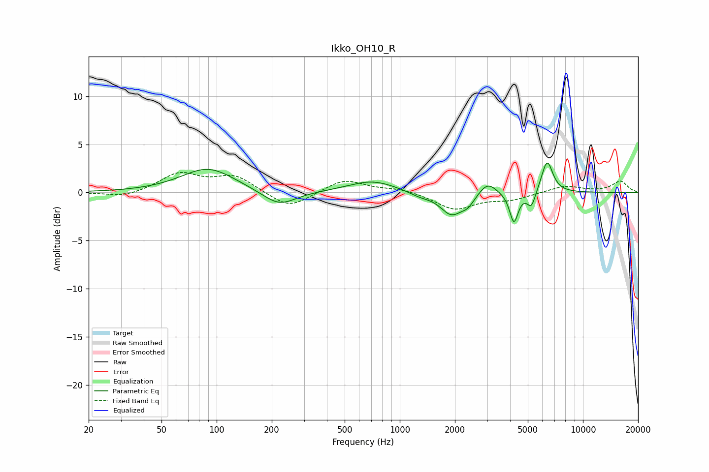

# Ikko_OH10_R
See [usage instructions](https://github.com/jaakkopasanen/AutoEq#usage) for more options and info.

### Parametric EQs
Apply preamp of -3.2 dB when using parametric equalizer.

|   # | Type    |   Fc (Hz) |    Q |   Gain (dB) |
|-----|---------|-----------|------|-------------|
|   1 | Peaking |        90 | 0.97 |         2.5 |
|   2 | Peaking |       219 | 1.54 |        -1.6 |
|   3 | Peaking |       708 | 1.08 |         1.2 |
|   4 | Peaking |      1287 | 2.25 |        -0.4 |
|   5 | Peaking |      1915 | 2.34 |        -2.3 |
|   6 | Peaking |      2354 | 3.95 |        -0.9 |
|   7 | Peaking |      3016 | 3.03 |         1.3 |
|   8 | Peaking |      4198 | 6    |        -3.1 |
|   9 | Peaking |      5229 | 6    |        -1.7 |
|  10 | Peaking |      6373 | 4.42 |         3.4 |

### Fixed Band EQs
When using fixed band (also called graphic) equalizer, apply preamp of **-2.2 dB** (if available) and set gains manually with these parameters.

|   # | Type    |   Fc (Hz) |    Q |   Gain (dB) |
|-----|---------|-----------|------|-------------|
|   1 | Peaking |        31 | 1.41 |        -0.6 |
|   2 | Peaking |        62 | 1.41 |         1.9 |
|   3 | Peaking |       125 | 1.41 |         1.7 |
|   4 | Peaking |       250 | 1.41 |        -1.7 |
|   5 | Peaking |       500 | 1.41 |         1.4 |
|   6 | Peaking |      1000 | 1.41 |         0.4 |
|   7 | Peaking |      2000 | 1.41 |        -1.7 |
|   8 | Peaking |      4000 | 1.41 |        -0.7 |
|   9 | Peaking |      8000 | 1.41 |         0.7 |
|  10 | Peaking |     16000 | 1.41 |         1.2 |

### Graphs

