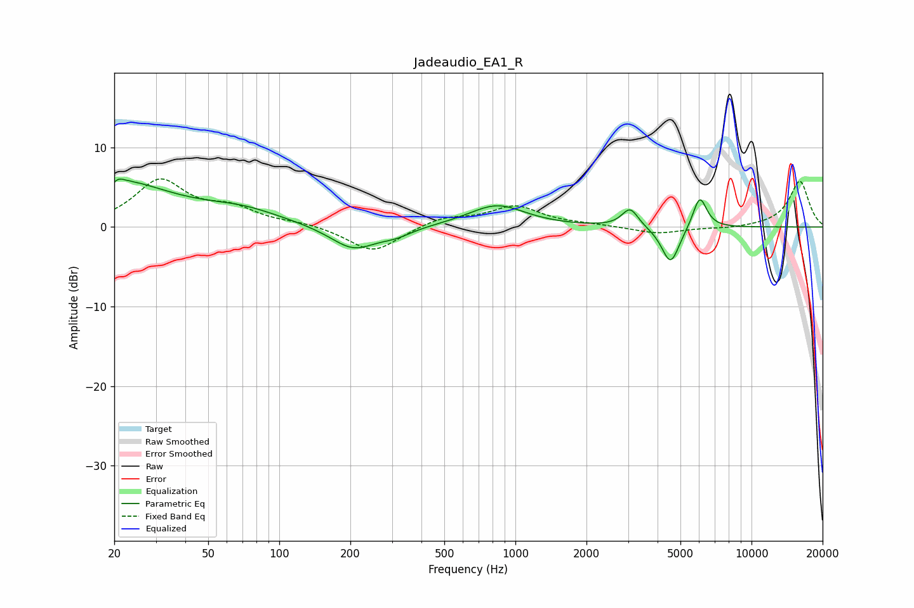

# Jadeaudio_EA1_R
See [usage instructions](https://github.com/jaakkopasanen/AutoEq#usage) for more options and info.

### Parametric EQs
Apply preamp of -6.1 dB when using parametric equalizer.

|   # | Type    |   Fc (Hz) |    Q |   Gain (dB) |
|-----|---------|-----------|------|-------------|
|   1 | Peaking |        20 | 0.6  |         5.7 |
|   2 | Peaking |        20 | 5.98 |        -3.4 |
|   3 | Peaking |        20 | 5.91 |         3.3 |
|   4 | Peaking |        70 | 0.83 |         1.7 |
|   5 | Peaking |       206 | 1.45 |        -3   |
|   6 | Peaking |       312 | 2.08 |        -0.8 |
|   7 | Peaking |       834 | 1.18 |         2.8 |
|   8 | Peaking |      3062 | 4.08 |         2.4 |
|   9 | Peaking |      4542 | 3.69 |        -4.8 |
|  10 | Peaking |      6036 | 4.67 |         4.1 |

### Fixed Band EQs
When using fixed band (also called graphic) equalizer, apply preamp of **-6.1 dB** (if available) and set gains manually with these parameters.

|   # | Type    |   Fc (Hz) |    Q |   Gain (dB) |
|-----|---------|-----------|------|-------------|
|   1 | Peaking |        31 | 1.41 |         5.7 |
|   2 | Peaking |        62 | 1.41 |         2   |
|   3 | Peaking |       125 | 1.41 |         0.4 |
|   4 | Peaking |       250 | 1.41 |        -3.3 |
|   5 | Peaking |       500 | 1.41 |         1.2 |
|   6 | Peaking |      1000 | 1.41 |         2.5 |
|   7 | Peaking |      2000 | 1.41 |         0.2 |
|   8 | Peaking |      4000 | 1.41 |        -0.9 |
|   9 | Peaking |      8000 | 1.41 |        -0.2 |
|  10 | Peaking |     16000 | 1.41 |         5.8 |

### Graphs

