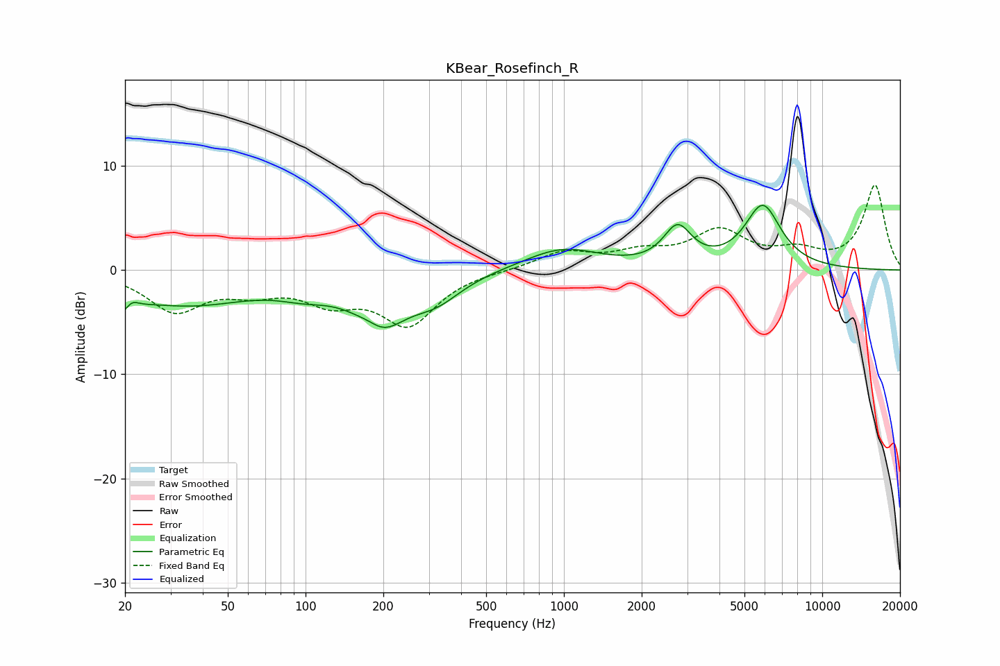

# KBear_Rosefinch_R
See [usage instructions](https://github.com/jaakkopasanen/AutoEq#usage) for more options and info.

### Parametric EQs
Apply preamp of -6.3 dB when using parametric equalizer.

|   # | Type    |   Fc (Hz) |    Q |   Gain (dB) |
|-----|---------|-----------|------|-------------|
|   1 | Peaking |        20 | 3.31 |        -3.4 |
|   2 | Peaking |        21 | 4.56 |         2.3 |
|   3 | Peaking |        35 | 0.55 |        -3.1 |
|   4 | Peaking |       100 | 1.32 |        -1.1 |
|   5 | Peaking |       178 | 2.39 |         1.4 |
|   6 | Peaking |       191 | 1.44 |        -5.4 |
|   7 | Peaking |       320 | 1.39 |        -2.2 |
|   8 | Peaking |       985 | 0.98 |         2.1 |
|   9 | Peaking |      2755 | 2.62 |         3.6 |
|  10 | Peaking |      5885 | 1.98 |         6   |

### Fixed Band EQs
When using fixed band (also called graphic) equalizer, apply preamp of **-8.2 dB** (if available) and set gains manually with these parameters.

|   # | Type    |   Fc (Hz) |    Q |   Gain (dB) |
|-----|---------|-----------|------|-------------|
|   1 | Peaking |        31 | 1.41 |        -3.7 |
|   2 | Peaking |        62 | 1.41 |        -1.6 |
|   3 | Peaking |       125 | 1.41 |        -2.5 |
|   4 | Peaking |       250 | 1.41 |        -5   |
|   5 | Peaking |       500 | 1.41 |        -0   |
|   6 | Peaking |      1000 | 1.41 |         1.7 |
|   7 | Peaking |      2000 | 1.41 |         1.4 |
|   8 | Peaking |      4000 | 1.41 |         3.5 |
|   9 | Peaking |      8000 | 1.41 |         1.5 |
|  10 | Peaking |     16000 | 1.41 |         8.1 |

### Graphs

