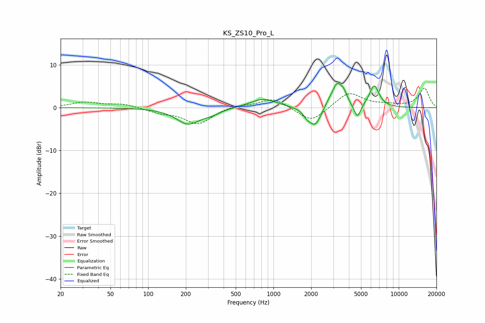

# KS_ZS10_Pro_L
See [usage instructions](https://github.com/jaakkopasanen/AutoEq#usage) for more options and info.

### Parametric EQs
Apply preamp of -5.8 dB when using parametric equalizer.

|   # | Type    |   Fc (Hz) |    Q |   Gain (dB) |
|-----|---------|-----------|------|-------------|
|   1 | Peaking |       209 | 1.49 |        -3.7 |
|   2 | Peaking |       321 | 2.16 |        -0.9 |
|   3 | Peaking |       829 | 1.36 |         2.2 |
|   4 | Peaking |      1843 | 5.16 |        -1   |
|   5 | Peaking |      2150 | 2.86 |        -4.6 |
|   6 | Peaking |      2719 | 3.96 |         0.6 |
|   7 | Peaking |      3226 | 3.19 |         5.6 |
|   8 | Peaking |      3650 | 5.56 |         1.6 |
|   9 | Peaking |      4672 | 5.17 |        -3.3 |
|  10 | Peaking |      6365 | 3.54 |         5.1 |

### Fixed Band EQs
When using fixed band (also called graphic) equalizer, apply preamp of **-4.6 dB** (if available) and set gains manually with these parameters.

|   # | Type    |   Fc (Hz) |    Q |   Gain (dB) |
|-----|---------|-----------|------|-------------|
|   1 | Peaking |        31 | 1.41 |         1.2 |
|   2 | Peaking |        62 | 1.41 |         0.9 |
|   3 | Peaking |       125 | 1.41 |        -1   |
|   4 | Peaking |       250 | 1.41 |        -3.8 |
|   5 | Peaking |       500 | 1.41 |         0.6 |
|   6 | Peaking |      1000 | 1.41 |         2.3 |
|   7 | Peaking |      2000 | 1.41 |        -3.5 |
|   8 | Peaking |      4000 | 1.41 |         3.7 |
|   9 | Peaking |      8000 | 1.41 |         0.5 |
|  10 | Peaking |     16000 | 1.41 |         4.5 |

### Graphs

