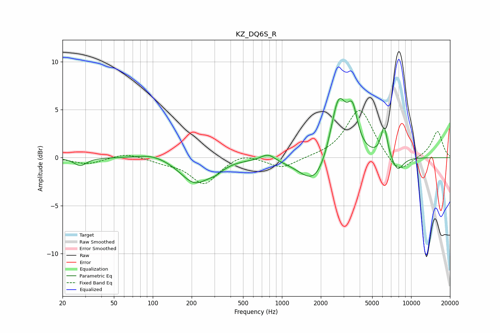

# KZ_DQ6S_R
See [usage instructions](https://github.com/jaakkopasanen/AutoEq#usage) for more options and info.

### Parametric EQs
Apply preamp of -6.3 dB when using parametric equalizer.

|   # | Type    |   Fc (Hz) |    Q |   Gain (dB) |
|-----|---------|-----------|------|-------------|
|   1 | Peaking |        27 | 3.03 |        -0.8 |
|   2 | Peaking |       100 | 1.14 |         0.6 |
|   3 | Peaking |       211 | 1.26 |        -2.6 |
|   4 | Peaking |       307 | 2.39 |        -0.6 |
|   5 | Peaking |       781 | 2.56 |         0.8 |
|   6 | Peaking |      1828 | 1.2  |        -3.3 |
|   7 | Peaking |      2738 | 2.21 |         6.9 |
|   8 | Peaking |      3524 | 3.71 |         3.6 |
|   9 | Peaking |      6190 | 5.51 |         3.2 |
|  10 | Peaking |      7841 | 2.94 |        -1.5 |

### Fixed Band EQs
When using fixed band (also called graphic) equalizer, apply preamp of **-5.0 dB** (if available) and set gains manually with these parameters.

|   # | Type    |   Fc (Hz) |    Q |   Gain (dB) |
|-----|---------|-----------|------|-------------|
|   1 | Peaking |        31 | 1.41 |        -0.7 |
|   2 | Peaking |        62 | 1.41 |         0.5 |
|   3 | Peaking |       125 | 1.41 |        -0.4 |
|   4 | Peaking |       250 | 1.41 |        -2.7 |
|   5 | Peaking |       500 | 1.41 |         0.6 |
|   6 | Peaking |      1000 | 1.41 |        -1.1 |
|   7 | Peaking |      2000 | 1.41 |         0.1 |
|   8 | Peaking |      4000 | 1.41 |         5.2 |
|   9 | Peaking |      8000 | 1.41 |        -1.9 |
|  10 | Peaking |     16000 | 1.41 |         2.8 |

### Graphs

