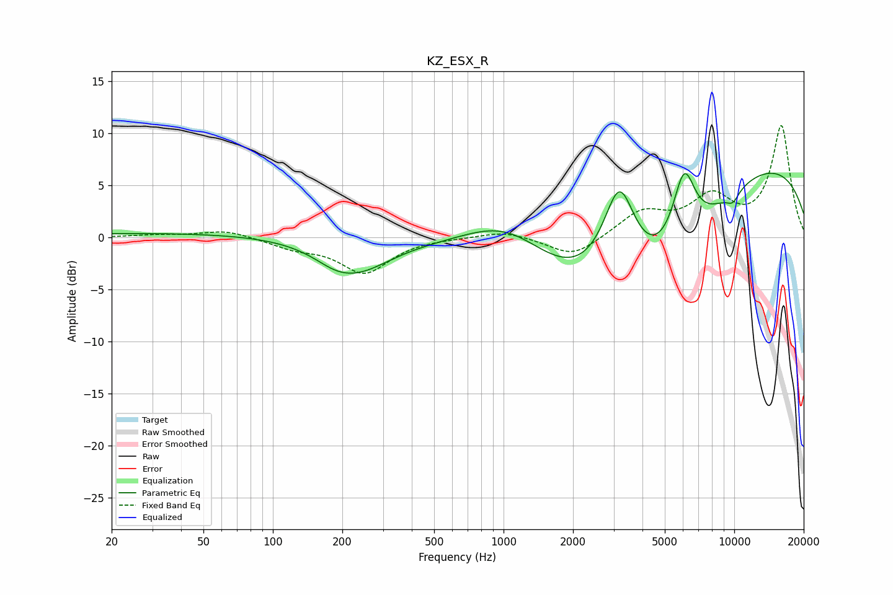

# KZ_ESX_R
See [usage instructions](https://github.com/jaakkopasanen/AutoEq#usage) for more options and info.

### Parametric EQs
Apply preamp of -6.3 dB when using parametric equalizer.

|   # | Type    |   Fc (Hz) |    Q |   Gain (dB) |
|-----|---------|-----------|------|-------------|
|   1 | Peaking |        44 | 0.18 |         0.5 |
|   2 | Peaking |       186 | 1.66 |        -0.7 |
|   3 | Peaking |       231 | 0.95 |        -3.1 |
|   4 | Peaking |      1043 | 0.68 |         5.2 |
|   5 | Peaking |      3179 | 1.79 |        10.4 |
|   6 | Peaking |      4234 | 0.3  |       -15.1 |
|   7 | Peaking |      6058 | 2.72 |         7.1 |
|   8 | Peaking |      9967 | 4    |        -5   |
|   9 | Peaking |     10000 | 4.02 |         3.9 |
|  10 | Peaking |     10000 | 0.28 |        13.2 |

### Fixed Band EQs
When using fixed band (also called graphic) equalizer, apply preamp of **-10.8 dB** (if available) and set gains manually with these parameters.

|   # | Type    |   Fc (Hz) |    Q |   Gain (dB) |
|-----|---------|-----------|------|-------------|
|   1 | Peaking |        31 | 1.41 |         0.2 |
|   2 | Peaking |        62 | 1.41 |         0.7 |
|   3 | Peaking |       125 | 1.41 |        -0.9 |
|   4 | Peaking |       250 | 1.41 |        -3.3 |
|   5 | Peaking |       500 | 1.41 |         0   |
|   6 | Peaking |      1000 | 1.41 |         0.7 |
|   7 | Peaking |      2000 | 1.41 |        -2   |
|   8 | Peaking |      4000 | 1.41 |         2.4 |
|   9 | Peaking |      8000 | 1.41 |         3.6 |
|  10 | Peaking |     16000 | 1.41 |        10.6 |

### Graphs

