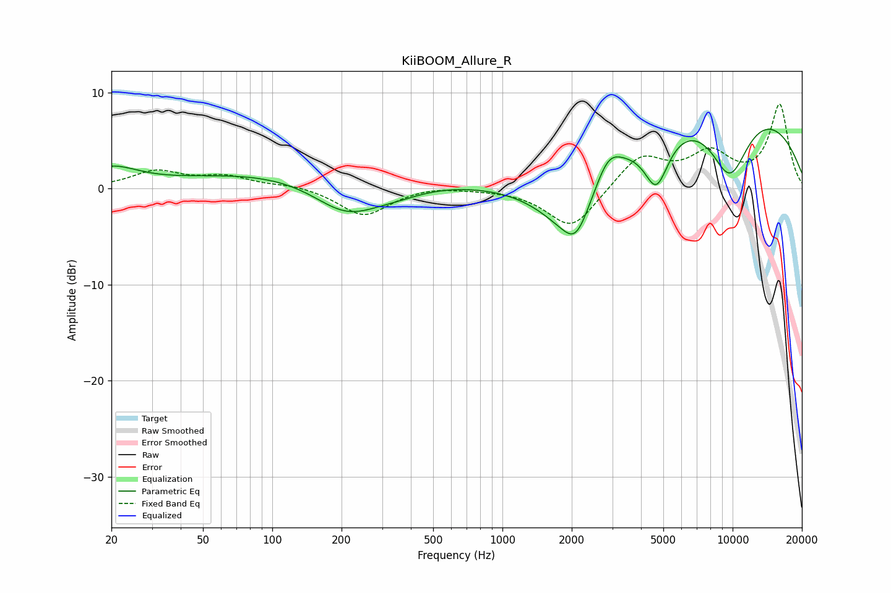

# KiiBOOM_Allure_R
See [usage instructions](https://github.com/jaakkopasanen/AutoEq#usage) for more options and info.

### Parametric EQs
Apply preamp of -6.3 dB when using parametric equalizer.

|   # | Type    |   Fc (Hz) |    Q |   Gain (dB) |
|-----|---------|-----------|------|-------------|
|   1 | Peaking |        20 | 1.24 |         2   |
|   2 | Peaking |       156 | 0.26 |         2.1 |
|   3 | Peaking |       211 | 0.94 |        -3.9 |
|   4 | Peaking |       351 | 1.01 |        -1.1 |
|   5 | Peaking |      1988 | 0.97 |        -6.4 |
|   6 | Peaking |      2087 | 2.66 |        -2.6 |
|   7 | Peaking |      2879 | 2.44 |         2.8 |
|   8 | Peaking |      4667 | 2.6  |        -5.5 |
|   9 | Peaking |      8942 | 0.25 |         9.6 |
|  10 | Peaking |      9709 | 1.38 |        -7.5 |

### Fixed Band EQs
When using fixed band (also called graphic) equalizer, apply preamp of **-8.9 dB** (if available) and set gains manually with these parameters.

|   # | Type    |   Fc (Hz) |    Q |   Gain (dB) |
|-----|---------|-----------|------|-------------|
|   1 | Peaking |        31 | 1.41 |         1.7 |
|   2 | Peaking |        62 | 1.41 |         1.2 |
|   3 | Peaking |       125 | 1.41 |         0.4 |
|   4 | Peaking |       250 | 1.41 |        -2.9 |
|   5 | Peaking |       500 | 1.41 |         0.4 |
|   6 | Peaking |      1000 | 1.41 |         0   |
|   7 | Peaking |      2000 | 1.41 |        -4.3 |
|   8 | Peaking |      4000 | 1.41 |         3.5 |
|   9 | Peaking |      8000 | 1.41 |         3.4 |
|  10 | Peaking |     16000 | 1.41 |         8.6 |

### Graphs

