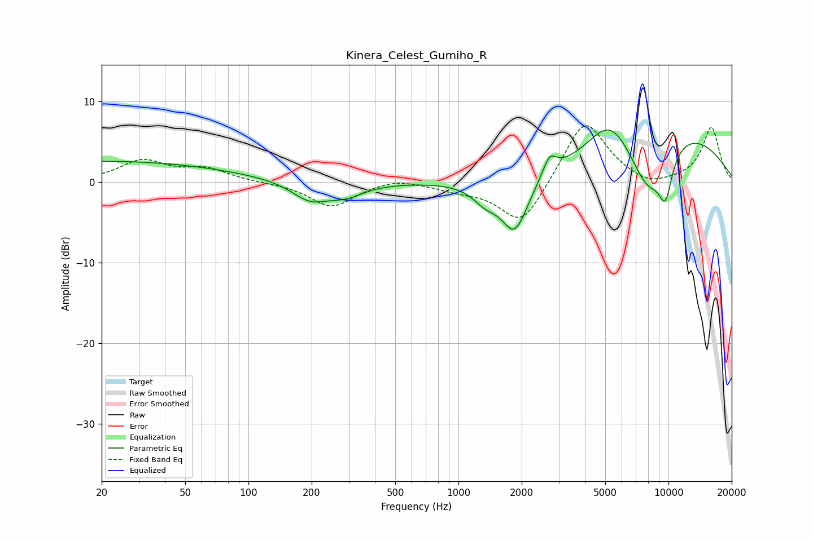

# Kinera_Celest_Gumiho_R
See [usage instructions](https://github.com/jaakkopasanen/AutoEq#usage) for more options and info.

### Parametric EQs
Apply preamp of -6.5 dB when using parametric equalizer.

|   # | Type    |   Fc (Hz) |    Q |   Gain (dB) |
|-----|---------|-----------|------|-------------|
|   1 | Peaking |        20 | 0.22 |         2.6 |
|   2 | Peaking |       196 | 1.62 |        -2.3 |
|   3 | Peaking |       291 | 1.58 |        -1.5 |
|   4 | Peaking |      1343 | 2.32 |        -1.9 |
|   5 | Peaking |      1854 | 2.18 |        -6.7 |
|   6 | Peaking |      2715 | 4.31 |         2.4 |
|   7 | Peaking |      5248 | 1.41 |         4.3 |
|   8 | Peaking |      7959 | 1.44 |        -7   |
|   9 | Peaking |      9675 | 3.69 |        -5.3 |
|  10 | Peaking |     10000 | 0.36 |         6.8 |

### Fixed Band EQs
When using fixed band (also called graphic) equalizer, apply preamp of **-7.1 dB** (if available) and set gains manually with these parameters.

|   # | Type    |   Fc (Hz) |    Q |   Gain (dB) |
|-----|---------|-----------|------|-------------|
|   1 | Peaking |        31 | 1.41 |         2.5 |
|   2 | Peaking |        62 | 1.41 |         1.5 |
|   3 | Peaking |       125 | 1.41 |        -0.1 |
|   4 | Peaking |       250 | 1.41 |        -3.1 |
|   5 | Peaking |       500 | 1.41 |         0.6 |
|   6 | Peaking |      1000 | 1.41 |        -0.8 |
|   7 | Peaking |      2000 | 1.41 |        -5.7 |
|   8 | Peaking |      4000 | 1.41 |         8.1 |
|   9 | Peaking |      8000 | 1.41 |        -1   |
|  10 | Peaking |     16000 | 1.41 |         6.8 |

### Graphs

