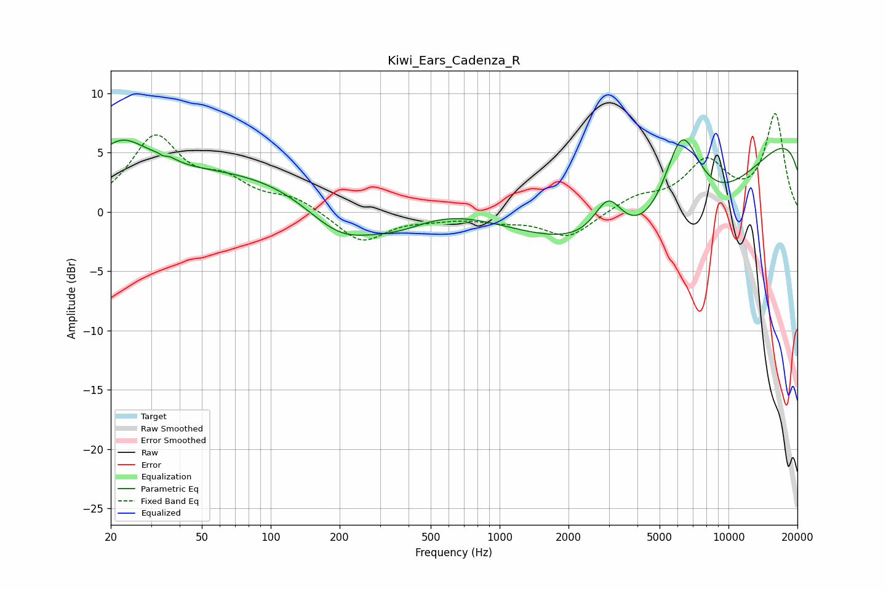

# Kiwi_Ears_Cadenza_R
See [usage instructions](https://github.com/jaakkopasanen/AutoEq#usage) for more options and info.

### Parametric EQs
Apply preamp of -6.2 dB when using parametric equalizer.

|   # | Type    |   Fc (Hz) |    Q |   Gain (dB) |
|-----|---------|-----------|------|-------------|
|   1 | Peaking |        22 | 1.12 |         4.3 |
|   2 | Peaking |        34 | 5.81 |        -2.9 |
|   3 | Peaking |        34 | 5.24 |         3.1 |
|   4 | Peaking |       134 | 0.18 |         3.9 |
|   5 | Peaking |       202 | 0.84 |        -4.3 |
|   6 | Peaking |       360 | 0.89 |        -2.4 |
|   7 | Peaking |      2985 | 2.23 |         3.6 |
|   8 | Peaking |      5688 | 0.3  |       -15.6 |
|   9 | Peaking |      6251 | 1.49 |         9.7 |
|  10 | Peaking |     10000 | 0.18 |        12.4 |

### Fixed Band EQs
When using fixed band (also called graphic) equalizer, apply preamp of **-8.4 dB** (if available) and set gains manually with these parameters.

|   # | Type    |   Fc (Hz) |    Q |   Gain (dB) |
|-----|---------|-----------|------|-------------|
|   1 | Peaking |        31 | 1.41 |         6.1 |
|   2 | Peaking |        62 | 1.41 |         2.1 |
|   3 | Peaking |       125 | 1.41 |         1.1 |
|   4 | Peaking |       250 | 1.41 |        -2.6 |
|   5 | Peaking |       500 | 1.41 |        -0.4 |
|   6 | Peaking |      1000 | 1.41 |        -0.6 |
|   7 | Peaking |      2000 | 1.41 |        -2.2 |
|   8 | Peaking |      4000 | 1.41 |         1.1 |
|   9 | Peaking |      8000 | 1.41 |         4   |
|  10 | Peaking |     16000 | 1.41 |         8.1 |

### Graphs

