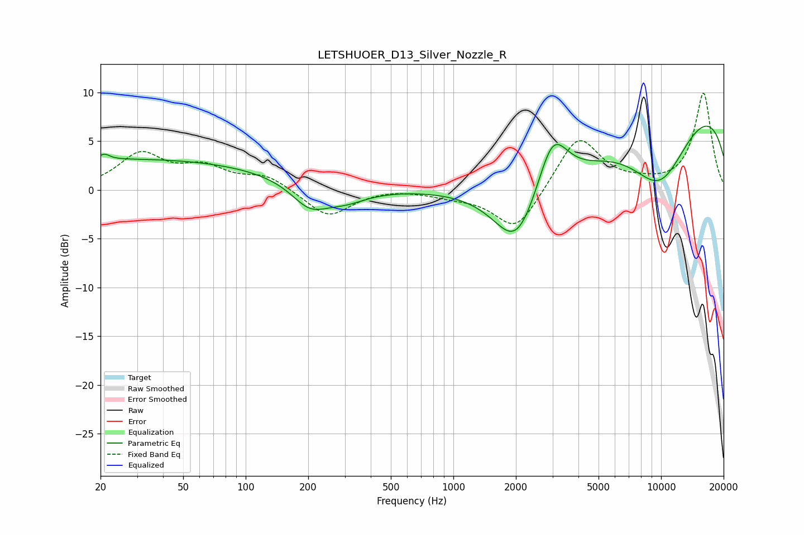

# LETSHUOER_D13_Silver_Nozzle_R
See [usage instructions](https://github.com/jaakkopasanen/AutoEq#usage) for more options and info.

### Parametric EQs
Apply preamp of -6.6 dB when using parametric equalizer.

|   # | Type    |   Fc (Hz) |    Q |   Gain (dB) |
|-----|---------|-----------|------|-------------|
|   1 | Peaking |        21 | 5.75 |         0.6 |
|   2 | Peaking |        29 | 0.18 |         3.1 |
|   3 | Peaking |       203 | 1.62 |        -2.4 |
|   4 | Peaking |       255 | 0.69 |         0   |
|   5 | Peaking |       299 | 1.27 |        -1.4 |
|   6 | Peaking |      2011 | 1.36 |        -5.6 |
|   7 | Peaking |      2901 | 0.58 |        -6.4 |
|   8 | Peaking |      3000 | 1.73 |         7.3 |
|   9 | Peaking |      9795 | 0.71 |        -9.5 |
|  10 | Peaking |      9988 | 0.2  |        11.5 |

### Fixed Band EQs
When using fixed band (also called graphic) equalizer, apply preamp of **-10.0 dB** (if available) and set gains manually with these parameters.

|   # | Type    |   Fc (Hz) |    Q |   Gain (dB) |
|-----|---------|-----------|------|-------------|
|   1 | Peaking |        31 | 1.41 |         3.5 |
|   2 | Peaking |        62 | 1.41 |         2   |
|   3 | Peaking |       125 | 1.41 |         1.4 |
|   4 | Peaking |       250 | 1.41 |        -2.8 |
|   5 | Peaking |       500 | 1.41 |         0.2 |
|   6 | Peaking |      1000 | 1.41 |        -0.5 |
|   7 | Peaking |      2000 | 1.41 |        -4.3 |
|   8 | Peaking |      4000 | 1.41 |         5.6 |
|   9 | Peaking |      8000 | 1.41 |         0.4 |
|  10 | Peaking |     16000 | 1.41 |         9.9 |

### Graphs

