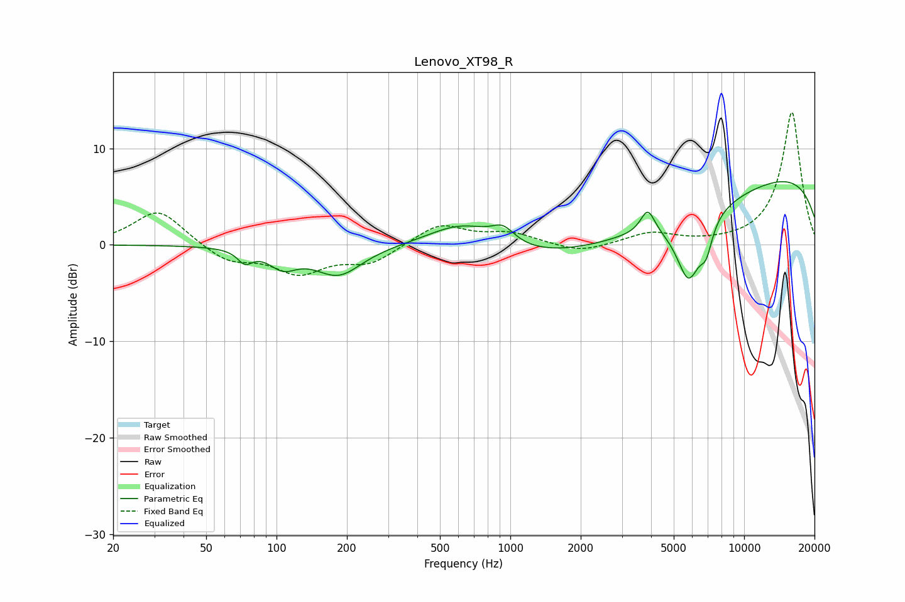

# Lenovo_XT98_R
See [usage instructions](https://github.com/jaakkopasanen/AutoEq#usage) for more options and info.

### Parametric EQs
Apply preamp of -6.7 dB when using parametric equalizer.

|   # | Type    |   Fc (Hz) |    Q |   Gain (dB) |
|-----|---------|-----------|------|-------------|
|   1 | Peaking |        73 | 4.65 |        -1.3 |
|   2 | Peaking |       106 | 2.38 |        -1.8 |
|   3 | Peaking |       184 | 1.39 |        -3.1 |
|   4 | Peaking |       626 | 0.95 |         2.9 |
|   5 | Peaking |       931 | 2.89 |         1.6 |
|   6 | Peaking |      3300 | 0.26 |        -4.7 |
|   7 | Peaking |      3871 | 4.64 |         2.5 |
|   8 | Peaking |      5791 | 2.58 |        -6.7 |
|   9 | Peaking |      6883 | 5.09 |        -2.6 |
|  10 | Peaking |     10000 | 0.18 |         8.4 |

### Fixed Band EQs
When using fixed band (also called graphic) equalizer, apply preamp of **-13.8 dB** (if available) and set gains manually with these parameters.

|   # | Type    |   Fc (Hz) |    Q |   Gain (dB) |
|-----|---------|-----------|------|-------------|
|   1 | Peaking |        31 | 1.41 |         3.7 |
|   2 | Peaking |        62 | 1.41 |        -1.7 |
|   3 | Peaking |       125 | 1.41 |        -2.7 |
|   4 | Peaking |       250 | 1.41 |        -1.8 |
|   5 | Peaking |       500 | 1.41 |         2.2 |
|   6 | Peaking |      1000 | 1.41 |         1.1 |
|   7 | Peaking |      2000 | 1.41 |        -0.9 |
|   8 | Peaking |      4000 | 1.41 |         1.2 |
|   9 | Peaking |      8000 | 1.41 |         0.1 |
|  10 | Peaking |     16000 | 1.41 |        13.8 |

### Graphs

