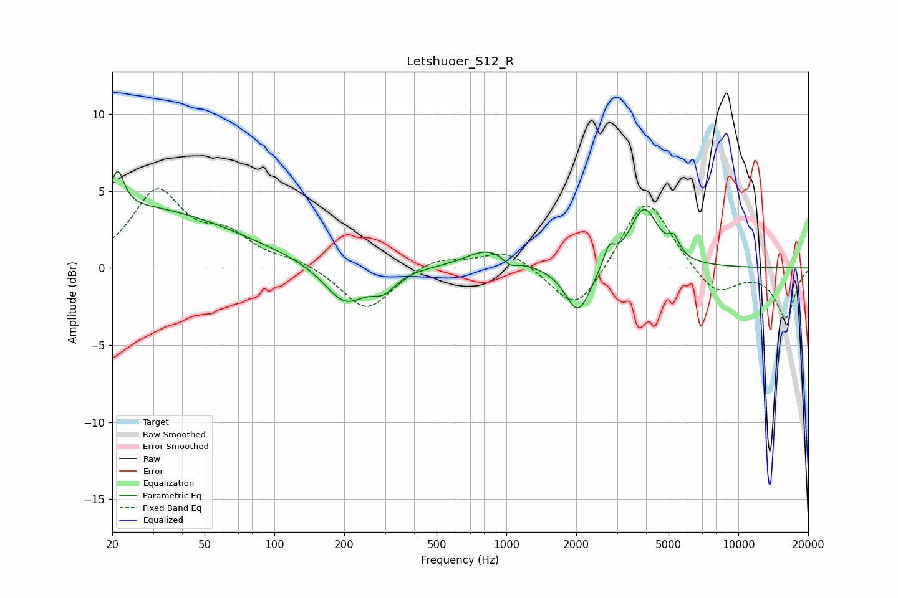

# Letshuoer_S12_R
See [usage instructions](https://github.com/jaakkopasanen/AutoEq#usage) for more options and info.

### Parametric EQs
Apply preamp of -6.4 dB when using parametric equalizer.

|   # | Type    |   Fc (Hz) |    Q |   Gain (dB) |
|-----|---------|-----------|------|-------------|
|   1 | Peaking |        21 | 5.24 |         2.4 |
|   2 | Peaking |        25 | 0.32 |         3.9 |
|   3 | Peaking |       201 | 1.6  |        -2.5 |
|   4 | Peaking |       295 | 2.64 |        -1.1 |
|   5 | Peaking |       841 | 1.45 |         1.3 |
|   6 | Peaking |      1035 | 4.51 |        -0.5 |
|   7 | Peaking |      2039 | 2.6  |        -3.1 |
|   8 | Peaking |      2770 | 5.97 |         1.2 |
|   9 | Peaking |      3921 | 2.27 |         3.9 |
|  10 | Peaking |      5276 | 5.97 |         1   |

### Fixed Band EQs
When using fixed band (also called graphic) equalizer, apply preamp of **-5.2 dB** (if available) and set gains manually with these parameters.

|   # | Type    |   Fc (Hz) |    Q |   Gain (dB) |
|-----|---------|-----------|------|-------------|
|   1 | Peaking |        31 | 1.41 |         4.8 |
|   2 | Peaking |        62 | 1.41 |         1.8 |
|   3 | Peaking |       125 | 1.41 |         0.5 |
|   4 | Peaking |       250 | 1.41 |        -2.8 |
|   5 | Peaking |       500 | 1.41 |         0.7 |
|   6 | Peaking |      1000 | 1.41 |         1.2 |
|   7 | Peaking |      2000 | 1.41 |        -3.1 |
|   8 | Peaking |      4000 | 1.41 |         4.8 |
|   9 | Peaking |      8000 | 1.41 |        -1.8 |
|  10 | Peaking |     16000 | 1.41 |        -3.2 |

### Graphs

