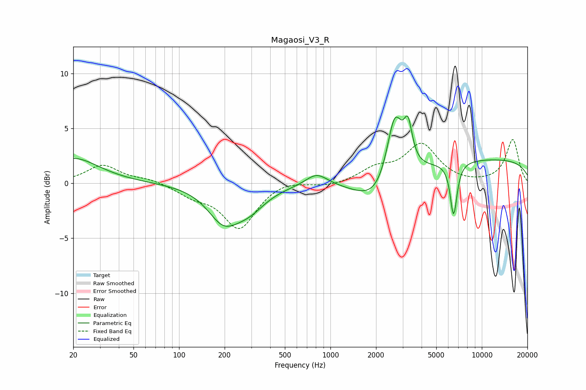

# Magaosi_V3_R
See [usage instructions](https://github.com/jaakkopasanen/AutoEq#usage) for more options and info.

### Parametric EQs
Apply preamp of -6.2 dB when using parametric equalizer.

|   # | Type    |   Fc (Hz) |    Q |   Gain (dB) |
|-----|---------|-----------|------|-------------|
|   1 | Peaking |        20 | 0.83 |         2.3 |
|   2 | Peaking |       196 | 1.38 |        -3   |
|   3 | Peaking |       289 | 1.25 |        -1.8 |
|   4 | Peaking |       811 | 1.97 |         1.1 |
|   5 | Peaking |      2137 | 0.96 |        -3.2 |
|   6 | Peaking |      2654 | 2.57 |         6.7 |
|   7 | Peaking |      3256 | 5.27 |         3.3 |
|   8 | Peaking |      6271 | 5.88 |         0.3 |
|   9 | Peaking |      6501 | 5.94 |        -5.1 |
|  10 | Peaking |     10000 | 0.18 |         2.2 |

### Fixed Band EQs
When using fixed band (also called graphic) equalizer, apply preamp of **-4.1 dB** (if available) and set gains manually with these parameters.

|   # | Type    |   Fc (Hz) |    Q |   Gain (dB) |
|-----|---------|-----------|------|-------------|
|   1 | Peaking |        31 | 1.41 |         1.6 |
|   2 | Peaking |        62 | 1.41 |         0.4 |
|   3 | Peaking |       125 | 1.41 |        -1   |
|   4 | Peaking |       250 | 1.41 |        -4   |
|   5 | Peaking |       500 | 1.41 |         0.4 |
|   6 | Peaking |      1000 | 1.41 |        -0.3 |
|   7 | Peaking |      2000 | 1.41 |         1.2 |
|   8 | Peaking |      4000 | 1.41 |         3.4 |
|   9 | Peaking |      8000 | 1.41 |        -0.1 |
|  10 | Peaking |     16000 | 1.41 |         4   |

### Graphs

