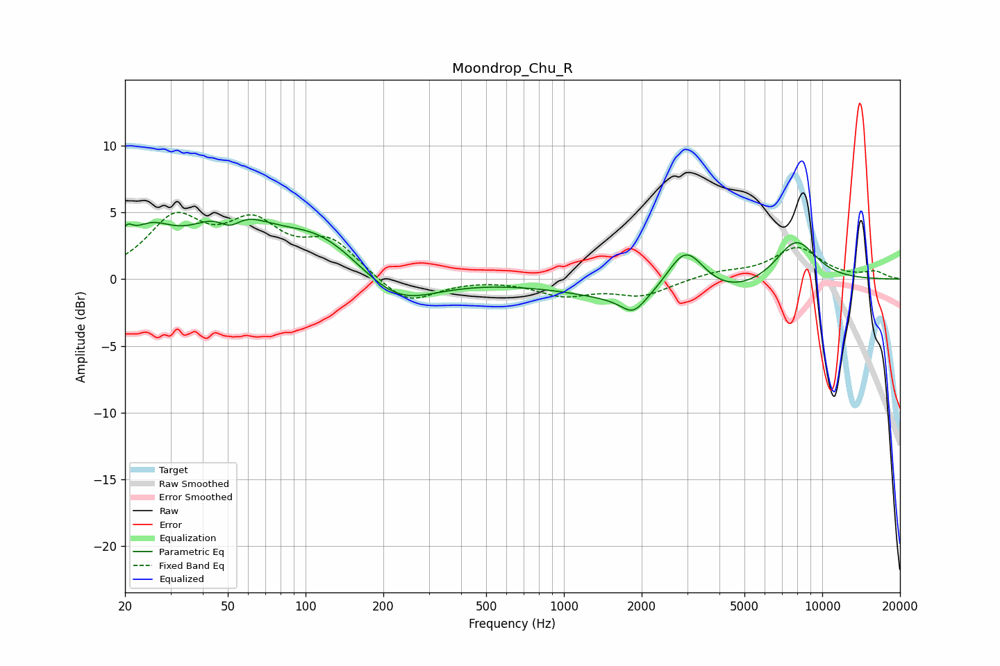

# Moondrop_Chu_R
See [usage instructions](https://github.com/jaakkopasanen/AutoEq#usage) for more options and info.

### Parametric EQs
Apply preamp of -4.6 dB when using parametric equalizer.

|   # | Type    |   Fc (Hz) |    Q |   Gain (dB) |
|-----|---------|-----------|------|-------------|
|   1 | Peaking |        20 | 5.94 |         1.3 |
|   2 | Peaking |        25 | 1.56 |         2.7 |
|   3 | Peaking |        51 | 1.04 |         4.2 |
|   4 | Peaking |        51 | 3.07 |        -1.4 |
|   5 | Peaking |       113 | 0.82 |         3.1 |
|   6 | Peaking |       226 | 0.97 |        -2.4 |
|   7 | Peaking |      1855 | 3.03 |        -1.3 |
|   8 | Peaking |      2770 | 0.48 |        -2.4 |
|   9 | Peaking |      2956 | 1.8  |         4.2 |
|  10 | Peaking |      7895 | 1.57 |         3.4 |

### Fixed Band EQs
When using fixed band (also called graphic) equalizer, apply preamp of **-5.1 dB** (if available) and set gains manually with these parameters.

|   # | Type    |   Fc (Hz) |    Q |   Gain (dB) |
|-----|---------|-----------|------|-------------|
|   1 | Peaking |        31 | 1.41 |         4.2 |
|   2 | Peaking |        62 | 1.41 |         3.6 |
|   3 | Peaking |       125 | 1.41 |         2.6 |
|   4 | Peaking |       250 | 1.41 |        -2   |
|   5 | Peaking |       500 | 1.41 |         0.1 |
|   6 | Peaking |      1000 | 1.41 |        -1.1 |
|   7 | Peaking |      2000 | 1.41 |        -1.2 |
|   8 | Peaking |      4000 | 1.41 |         0.5 |
|   9 | Peaking |      8000 | 1.41 |         2.3 |
|  10 | Peaking |     16000 | 1.41 |         0.5 |

### Graphs

