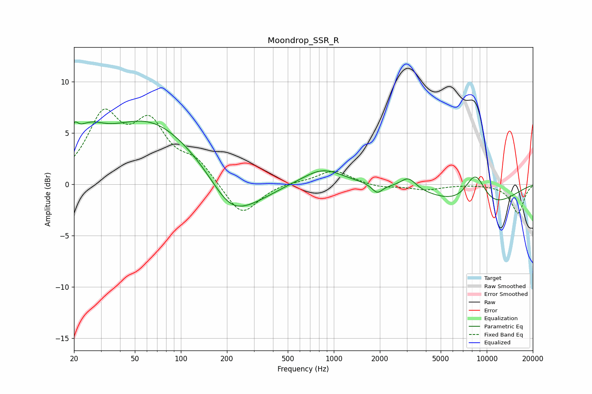

# Moondrop_SSR_R
See [usage instructions](https://github.com/jaakkopasanen/AutoEq#usage) for more options and info.

### Parametric EQs
Apply preamp of -6.3 dB when using parametric equalizer.

|   # | Type    |   Fc (Hz) |    Q |   Gain (dB) |
|-----|---------|-----------|------|-------------|
|   1 | Peaking |        20 | 6    |         1.5 |
|   2 | Peaking |        24 | 1.29 |         2.8 |
|   3 | Peaking |        62 | 0.46 |         6   |
|   4 | Peaking |       210 | 1.08 |        -3.1 |
|   5 | Peaking |       301 | 0.89 |        -1.2 |
|   6 | Peaking |       846 | 1.07 |         1.6 |
|   7 | Peaking |      1922 | 4.17 |        -0.9 |
|   8 | Peaking |      3073 | 2.81 |         1.1 |
|   9 | Peaking |      8417 | 1.8  |         3.6 |
|  10 | Peaking |      8732 | 0.55 |        -2.9 |

### Fixed Band EQs
When using fixed band (also called graphic) equalizer, apply preamp of **-7.4 dB** (if available) and set gains manually with these parameters.

|   # | Type    |   Fc (Hz) |    Q |   Gain (dB) |
|-----|---------|-----------|------|-------------|
|   1 | Peaking |        31 | 1.41 |         6.3 |
|   2 | Peaking |        62 | 1.41 |         5.2 |
|   3 | Peaking |       125 | 1.41 |         2   |
|   4 | Peaking |       250 | 1.41 |        -3.2 |
|   5 | Peaking |       500 | 1.41 |         0.2 |
|   6 | Peaking |      1000 | 1.41 |         1.4 |
|   7 | Peaking |      2000 | 1.41 |        -0.3 |
|   8 | Peaking |      4000 | 1.41 |        -0.5 |
|   9 | Peaking |      8000 | 1.41 |         0   |
|  10 | Peaking |     16000 | 1.41 |        -2.8 |

### Graphs

