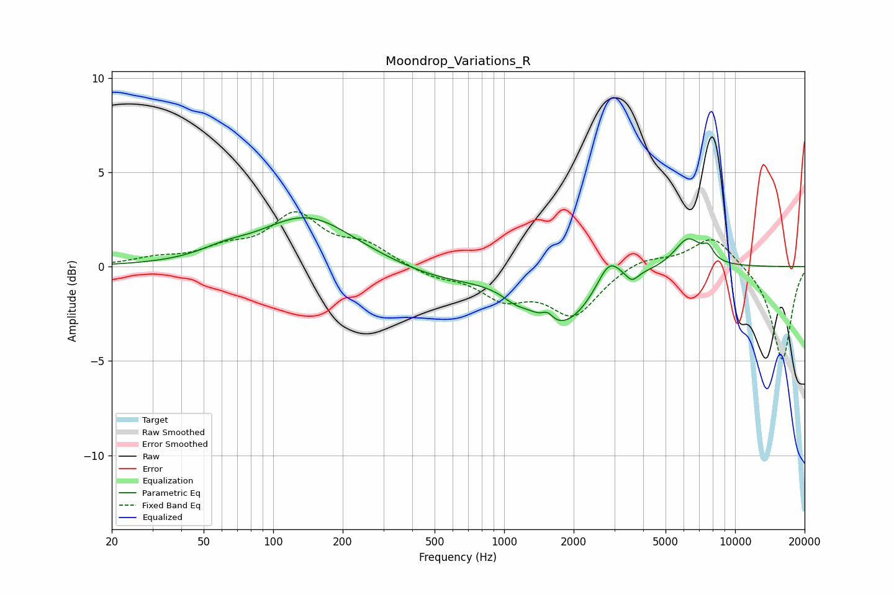

# Moondrop_Variations_R
See [usage instructions](https://github.com/jaakkopasanen/AutoEq#usage) for more options and info.

### Parametric EQs
Apply preamp of -2.7 dB when using parametric equalizer.

|   # | Type    |   Fc (Hz) |    Q |   Gain (dB) |
|-----|---------|-----------|------|-------------|
|   1 | Peaking |        61 | 1.41 |         0.4 |
|   2 | Peaking |       140 | 0.7  |         2.6 |
|   3 | Peaking |       526 | 0.71 |        -0.6 |
|   4 | Peaking |      1104 | 2.87 |        -0.3 |
|   5 | Peaking |      1543 | 6    |         0.4 |
|   6 | Peaking |      1767 | 1.01 |        -3   |
|   7 | Peaking |      2844 | 2.8  |         1.5 |
|   8 | Peaking |      3578 | 5.29 |        -0.5 |
|   9 | Peaking |      6249 | 2.27 |         1.6 |
|  10 | Peaking |      7653 | 5.84 |         0.6 |

### Fixed Band EQs
When using fixed band (also called graphic) equalizer, apply preamp of **-3.0 dB** (if available) and set gains manually with these parameters.

|   # | Type    |   Fc (Hz) |    Q |   Gain (dB) |
|-----|---------|-----------|------|-------------|
|   1 | Peaking |        31 | 1.41 |         0.4 |
|   2 | Peaking |        62 | 1.41 |         0.8 |
|   3 | Peaking |       125 | 1.41 |         2.6 |
|   4 | Peaking |       250 | 1.41 |         1   |
|   5 | Peaking |       500 | 1.41 |        -0.5 |
|   6 | Peaking |      1000 | 1.41 |        -1.5 |
|   7 | Peaking |      2000 | 1.41 |        -2.5 |
|   8 | Peaking |      4000 | 1.41 |         0.5 |
|   9 | Peaking |      8000 | 1.41 |         1.7 |
|  10 | Peaking |     16000 | 1.41 |        -5   |

### Graphs

