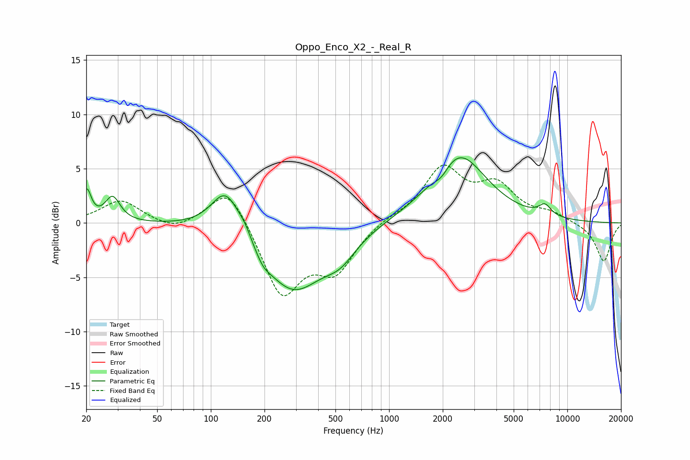

# Oppo_Enco_X2_-_Real_R
See [usage instructions](https://github.com/jaakkopasanen/AutoEq#usage) for more options and info.

### Parametric EQs
Apply preamp of -6.1 dB when using parametric equalizer.

|   # | Type    |   Fc (Hz) |    Q |   Gain (dB) |
|-----|---------|-----------|------|-------------|
|   1 | Peaking |        20 | 5.74 |         2.8 |
|   2 | Peaking |        28 | 3.43 |         2.3 |
|   3 | Peaking |       122 | 1.71 |         4.2 |
|   4 | Peaking |       155 | 3.86 |         0.7 |
|   5 | Peaking |       196 | 3.39 |        -0.8 |
|   6 | Peaking |       288 | 0.81 |        -6.2 |
|   7 | Peaking |       533 | 1.6  |        -1.7 |
|   8 | Peaking |      1970 | 3.31 |        -0.9 |
|   9 | Peaking |      2445 | 0.92 |         6.4 |
|  10 | Peaking |      7485 | 3.86 |         1   |

### Fixed Band EQs
When using fixed band (also called graphic) equalizer, apply preamp of **-5.4 dB** (if available) and set gains manually with these parameters.

|   # | Type    |   Fc (Hz) |    Q |   Gain (dB) |
|-----|---------|-----------|------|-------------|
|   1 | Peaking |        31 | 1.41 |         2.1 |
|   2 | Peaking |        62 | 1.41 |        -0.8 |
|   3 | Peaking |       125 | 1.41 |         3.7 |
|   4 | Peaking |       250 | 1.41 |        -6.6 |
|   5 | Peaking |       500 | 1.41 |        -4   |
|   6 | Peaking |      1000 | 1.41 |         0.4 |
|   7 | Peaking |      2000 | 1.41 |         4.9 |
|   8 | Peaking |      4000 | 1.41 |         3.1 |
|   9 | Peaking |      8000 | 1.41 |         0.8 |
|  10 | Peaking |     16000 | 1.41 |        -3.6 |

### Graphs

