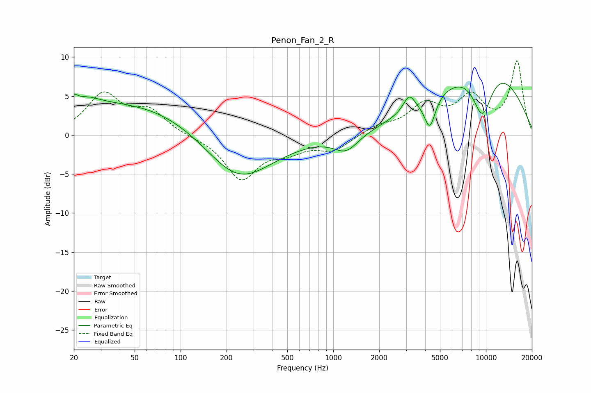

# Penon_Fan_2_R
See [usage instructions](https://github.com/jaakkopasanen/AutoEq#usage) for more options and info.

### Parametric EQs
Apply preamp of -6.7 dB when using parametric equalizer.

|   # | Type    |   Fc (Hz) |    Q |   Gain (dB) |
|-----|---------|-----------|------|-------------|
|   1 | Peaking |        20 | 5.92 |         1.1 |
|   2 | Peaking |        24 | 1.55 |         1.4 |
|   3 | Peaking |        49 | 0.29 |         4.2 |
|   4 | Peaking |        49 | 5.89 |        -0   |
|   5 | Peaking |       237 | 0.63 |        -6.4 |
|   6 | Peaking |      1213 | 1.75 |        -2.2 |
|   7 | Peaking |      3142 | 3.75 |         2.1 |
|   8 | Peaking |      4288 | 3.91 |        -4   |
|   9 | Peaking |      9476 | 1.8  |        -6.8 |
|  10 | Peaking |      9628 | 0.39 |         9.6 |

### Fixed Band EQs
When using fixed band (also called graphic) equalizer, apply preamp of **-9.6 dB** (if available) and set gains manually with these parameters.

|   # | Type    |   Fc (Hz) |    Q |   Gain (dB) |
|-----|---------|-----------|------|-------------|
|   1 | Peaking |        31 | 1.41 |         5.1 |
|   2 | Peaking |        62 | 1.41 |         2.8 |
|   3 | Peaking |       125 | 1.41 |        -0.2 |
|   4 | Peaking |       250 | 1.41 |        -5.5 |
|   5 | Peaking |       500 | 1.41 |        -1.7 |
|   6 | Peaking |      1000 | 1.41 |        -1.9 |
|   7 | Peaking |      2000 | 1.41 |         1   |
|   8 | Peaking |      4000 | 1.41 |         3.6 |
|   9 | Peaking |      8000 | 1.41 |         4.4 |
|  10 | Peaking |     16000 | 1.41 |         9.3 |

### Graphs

