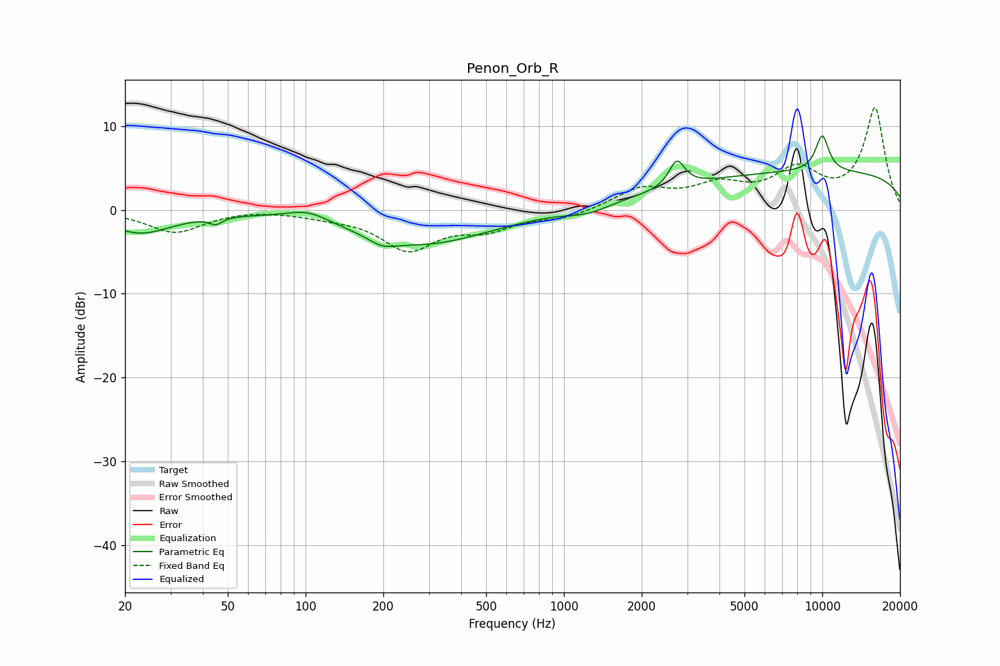

# Penon_Orb_R
See [usage instructions](https://github.com/jaakkopasanen/AutoEq#usage) for more options and info.

### Parametric EQs
Apply preamp of -8.9 dB when using parametric equalizer.

|   # | Type    |   Fc (Hz) |    Q |   Gain (dB) |
|-----|---------|-----------|------|-------------|
|   1 | Peaking |        23 | 1.14 |        -2.7 |
|   2 | Peaking |        45 | 5.91 |        -0.8 |
|   3 | Peaking |       102 | 1.7  |         1.3 |
|   4 | Peaking |       198 | 2.69 |        -1   |
|   5 | Peaking |       284 | 0.54 |        -4.1 |
|   6 | Peaking |      1240 | 1.75 |        -0.9 |
|   7 | Peaking |      2737 | 4.72 |         3.2 |
|   8 | Peaking |     10000 | 0.18 |         4.6 |
|   9 | Peaking |     10000 | 4.59 |         2   |
|  10 | Peaking |     10000 | 4.61 |         2.3 |

### Fixed Band EQs
When using fixed band (also called graphic) equalizer, apply preamp of **-12.3 dB** (if available) and set gains manually with these parameters.

|   # | Type    |   Fc (Hz) |    Q |   Gain (dB) |
|-----|---------|-----------|------|-------------|
|   1 | Peaking |        31 | 1.41 |        -2.6 |
|   2 | Peaking |        62 | 1.41 |         0.2 |
|   3 | Peaking |       125 | 1.41 |        -0.5 |
|   4 | Peaking |       250 | 1.41 |        -4.5 |
|   5 | Peaking |       500 | 1.41 |        -2   |
|   6 | Peaking |      1000 | 1.41 |        -1   |
|   7 | Peaking |      2000 | 1.41 |         2.4 |
|   8 | Peaking |      4000 | 1.41 |         2.5 |
|   9 | Peaking |      8000 | 1.41 |         4.3 |
|  10 | Peaking |     16000 | 1.41 |        12   |

### Graphs

