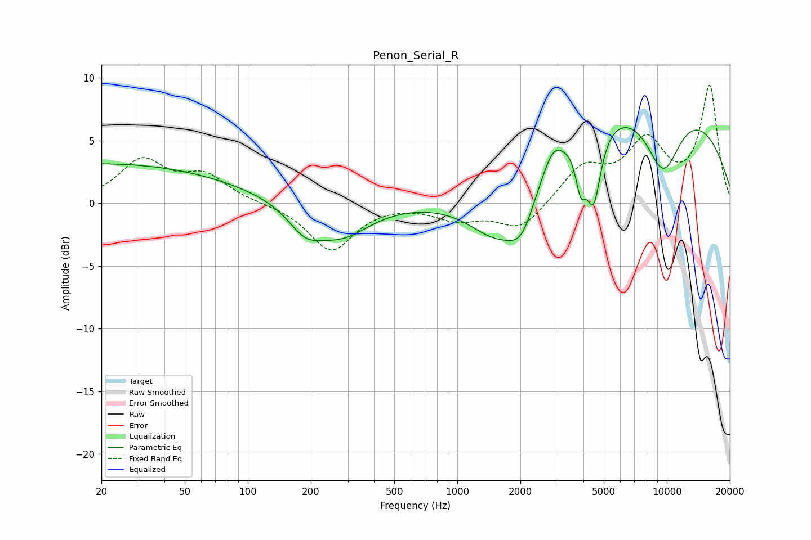

# Penon_Serial_R
See [usage instructions](https://github.com/jaakkopasanen/AutoEq#usage) for more options and info.

### Parametric EQs
Apply preamp of -6.1 dB when using parametric equalizer.

|   # | Type    |   Fc (Hz) |    Q |   Gain (dB) |
|-----|---------|-----------|------|-------------|
|   1 | Peaking |        20 | 0.21 |         3.2 |
|   2 | Peaking |       188 | 1.71 |        -2   |
|   3 | Peaking |       281 | 1.06 |        -2.5 |
|   4 | Peaking |      1579 | 0.95 |        -5   |
|   5 | Peaking |      2036 | 2.19 |        -3   |
|   6 | Peaking |      2858 | 3.19 |         1.4 |
|   7 | Peaking |      3880 | 5.77 |        -3.2 |
|   8 | Peaking |      4473 | 3.97 |        -5.8 |
|   9 | Peaking |      7828 | 0.23 |         8.9 |
|  10 | Peaking |      9604 | 1.43 |        -5.7 |

### Fixed Band EQs
When using fixed band (also called graphic) equalizer, apply preamp of **-9.5 dB** (if available) and set gains manually with these parameters.

|   # | Type    |   Fc (Hz) |    Q |   Gain (dB) |
|-----|---------|-----------|------|-------------|
|   1 | Peaking |        31 | 1.41 |         3.3 |
|   2 | Peaking |        62 | 1.41 |         2   |
|   3 | Peaking |       125 | 1.41 |        -0   |
|   4 | Peaking |       250 | 1.41 |        -3.8 |
|   5 | Peaking |       500 | 1.41 |         0.1 |
|   6 | Peaking |      1000 | 1.41 |        -1.2 |
|   7 | Peaking |      2000 | 1.41 |        -2.1 |
|   8 | Peaking |      4000 | 1.41 |         2.8 |
|   9 | Peaking |      8000 | 1.41 |         4.6 |
|  10 | Peaking |     16000 | 1.41 |         9.2 |

### Graphs

