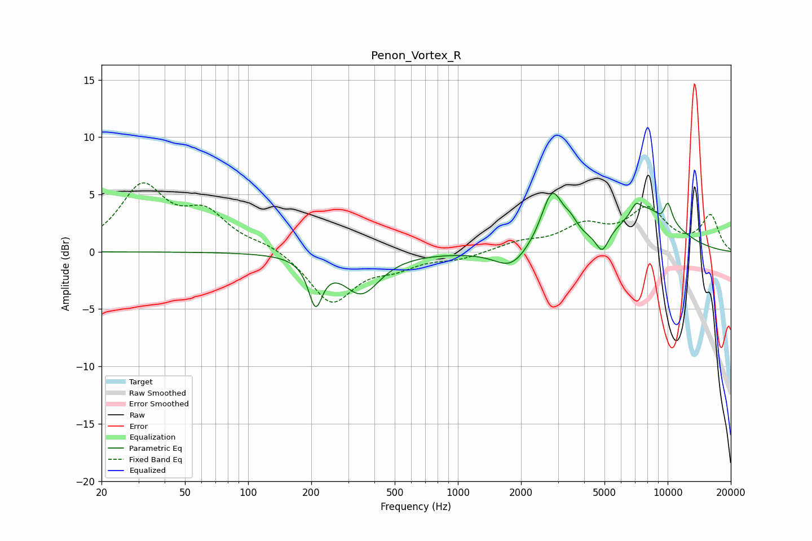

# Penon_Vortex_R
See [usage instructions](https://github.com/jaakkopasanen/AutoEq#usage) for more options and info.

### Parametric EQs
Apply preamp of -5.2 dB when using parametric equalizer.

|   # | Type    |   Fc (Hz) |    Q |   Gain (dB) |
|-----|---------|-----------|------|-------------|
|   1 | Peaking |       210 | 4.28 |        -3.9 |
|   2 | Peaking |       347 | 1.62 |        -3.5 |
|   3 | Peaking |      1795 | 1.82 |        -1.7 |
|   4 | Peaking |      2813 | 2.69 |         4.9 |
|   5 | Peaking |      3454 | 4.4  |         0.9 |
|   6 | Peaking |      4879 | 4.65 |        -1.8 |
|   7 | Peaking |      7061 | 5.99 |         0.9 |
|   8 | Peaking |      8197 | 0.94 |         3.8 |
|   9 | Peaking |      9522 | 3.33 |        -1.1 |
|  10 | Peaking |     10000 | 5.74 |         2.1 |

### Fixed Band EQs
When using fixed band (also called graphic) equalizer, apply preamp of **-6.1 dB** (if available) and set gains manually with these parameters.

|   # | Type    |   Fc (Hz) |    Q |   Gain (dB) |
|-----|---------|-----------|------|-------------|
|   1 | Peaking |        31 | 1.41 |         5.5 |
|   2 | Peaking |        62 | 1.41 |         3   |
|   3 | Peaking |       125 | 1.41 |         0.6 |
|   4 | Peaking |       250 | 1.41 |        -4.4 |
|   5 | Peaking |       500 | 1.41 |        -1.1 |
|   6 | Peaking |      1000 | 1.41 |        -0.6 |
|   7 | Peaking |      2000 | 1.41 |         0.7 |
|   8 | Peaking |      4000 | 1.41 |         2   |
|   9 | Peaking |      8000 | 1.41 |         3.5 |
|  10 | Peaking |     16000 | 1.41 |         3.1 |

### Graphs

