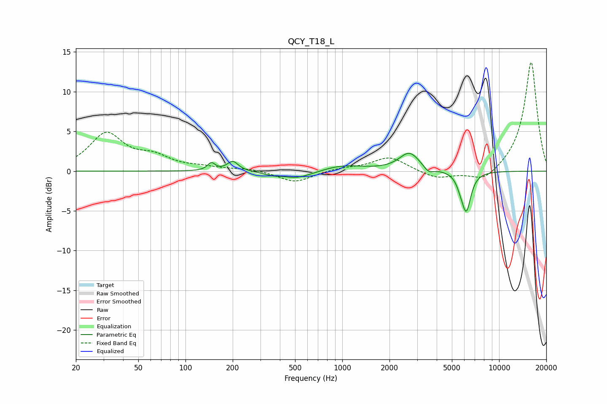

# QCY_T18_L
See [usage instructions](https://github.com/jaakkopasanen/AutoEq#usage) for more options and info.

### Parametric EQs
Apply preamp of -2.3 dB when using parametric equalizer.

|   # | Type    |   Fc (Hz) |    Q |   Gain (dB) |
|-----|---------|-----------|------|-------------|
|   1 | Peaking |       146 | 5.98 |         1   |
|   2 | Peaking |       200 | 4.07 |         1.2 |
|   3 | Peaking |       361 | 2.63 |        -0.4 |
|   4 | Peaking |       498 | 2.35 |        -0.3 |
|   5 | Peaking |       546 | 1.24 |        -0.7 |
|   6 | Peaking |      1002 | 1.03 |         0.8 |
|   7 | Peaking |      2681 | 2.17 |         2.3 |
|   8 | Peaking |      3554 | 4.39 |        -0.8 |
|   9 | Peaking |      5642 | 6    |        -0.7 |
|  10 | Peaking |      6174 | 4.68 |        -4.9 |

### Fixed Band EQs
When using fixed band (also called graphic) equalizer, apply preamp of **-13.8 dB** (if available) and set gains manually with these parameters.

|   # | Type    |   Fc (Hz) |    Q |   Gain (dB) |
|-----|---------|-----------|------|-------------|
|   1 | Peaking |        31 | 1.41 |         4.6 |
|   2 | Peaking |        62 | 1.41 |         1.5 |
|   3 | Peaking |       125 | 1.41 |         0.4 |
|   4 | Peaking |       250 | 1.41 |         0.3 |
|   5 | Peaking |       500 | 1.41 |        -1.4 |
|   6 | Peaking |      1000 | 1.41 |         0.4 |
|   7 | Peaking |      2000 | 1.41 |         1.8 |
|   8 | Peaking |      4000 | 1.41 |        -1   |
|   9 | Peaking |      8000 | 1.41 |        -1.5 |
|  10 | Peaking |     16000 | 1.41 |        13.9 |

### Graphs

