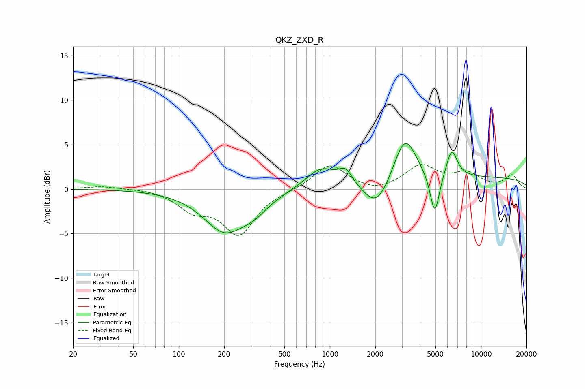

# QKZ_ZXD_R
See [usage instructions](https://github.com/jaakkopasanen/AutoEq#usage) for more options and info.

### Parametric EQs
Apply preamp of -5.2 dB when using parametric equalizer.

|   # | Type    |   Fc (Hz) |    Q |   Gain (dB) |
|-----|---------|-----------|------|-------------|
|   1 | Peaking |       202 | 1.01 |        -4.6 |
|   2 | Peaking |       318 | 1.64 |        -1.3 |
|   3 | Peaking |       468 | 2.13 |        -0.1 |
|   4 | Peaking |       877 | 1.4  |         2.4 |
|   5 | Peaking |      1271 | 3.19 |         1.6 |
|   6 | Peaking |      2047 | 1.63 |        -3.3 |
|   7 | Peaking |      3138 | 1.88 |         5.3 |
|   8 | Peaking |      4947 | 4.43 |        -4.9 |
|   9 | Peaking |      6403 | 3.76 |         3.2 |
|  10 | Peaking |      9727 | 0.18 |         1.3 |

### Fixed Band EQs
When using fixed band (also called graphic) equalizer, apply preamp of **-2.9 dB** (if available) and set gains manually with these parameters.

|   # | Type    |   Fc (Hz) |    Q |   Gain (dB) |
|-----|---------|-----------|------|-------------|
|   1 | Peaking |        31 | 1.41 |         0.3 |
|   2 | Peaking |        62 | 1.41 |         0.1 |
|   3 | Peaking |       125 | 1.41 |        -2.1 |
|   4 | Peaking |       250 | 1.41 |        -4.9 |
|   5 | Peaking |       500 | 1.41 |        -0.1 |
|   6 | Peaking |      1000 | 1.41 |         2.8 |
|   7 | Peaking |      2000 | 1.41 |        -0.5 |
|   8 | Peaking |      4000 | 1.41 |         2.5 |
|   9 | Peaking |      8000 | 1.41 |         1.6 |
|  10 | Peaking |     16000 | 1.41 |         1.5 |

### Graphs

