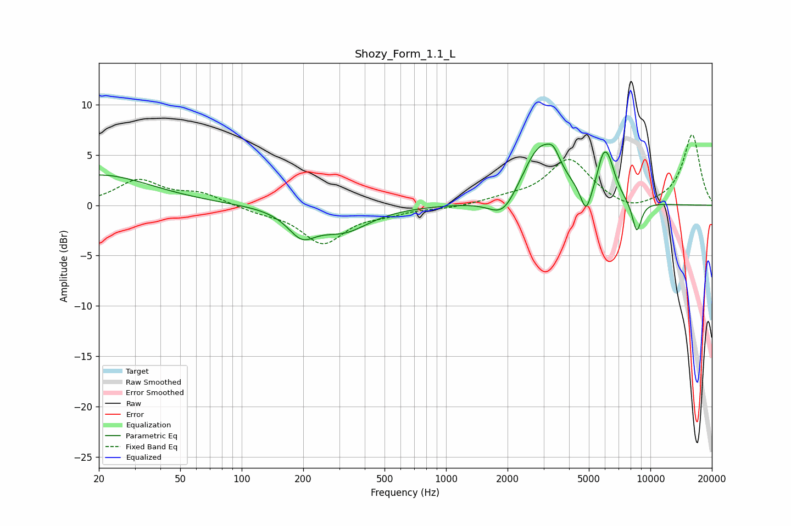

# Shozy_Form_1.1_L
See [usage instructions](https://github.com/jaakkopasanen/AutoEq#usage) for more options and info.

### Parametric EQs
Apply preamp of -6.2 dB when using parametric equalizer.

|   # | Type    |   Fc (Hz) |    Q |   Gain (dB) |
|-----|---------|-----------|------|-------------|
|   1 | Peaking |        20 | 0.56 |         3   |
|   2 | Peaking |       197 | 2.06 |        -2.4 |
|   3 | Peaking |       315 | 1.11 |        -2.4 |
|   4 | Peaking |      1909 | 2.02 |        -2.5 |
|   5 | Peaking |      2903 | 1.49 |         6.1 |
|   6 | Peaking |      3358 | 4.94 |         1.2 |
|   7 | Peaking |      4841 | 5.35 |        -2.7 |
|   8 | Peaking |      5799 | 5.84 |         1.5 |
|   9 | Peaking |      6179 | 3.68 |         3.9 |
|  10 | Peaking |      8579 | 5.61 |        -3.1 |

### Fixed Band EQs
When using fixed band (also called graphic) equalizer, apply preamp of **-7.1 dB** (if available) and set gains manually with these parameters.

|   # | Type    |   Fc (Hz) |    Q |   Gain (dB) |
|-----|---------|-----------|------|-------------|
|   1 | Peaking |        31 | 1.41 |         2.4 |
|   2 | Peaking |        62 | 1.41 |         1.1 |
|   3 | Peaking |       125 | 1.41 |        -0.5 |
|   4 | Peaking |       250 | 1.41 |        -3.7 |
|   5 | Peaking |       500 | 1.41 |        -0.6 |
|   6 | Peaking |      1000 | 1.41 |        -0.3 |
|   7 | Peaking |      2000 | 1.41 |         0.5 |
|   8 | Peaking |      4000 | 1.41 |         4.5 |
|   9 | Peaking |      8000 | 1.41 |        -0.8 |
|  10 | Peaking |     16000 | 1.41 |         7   |

### Graphs

