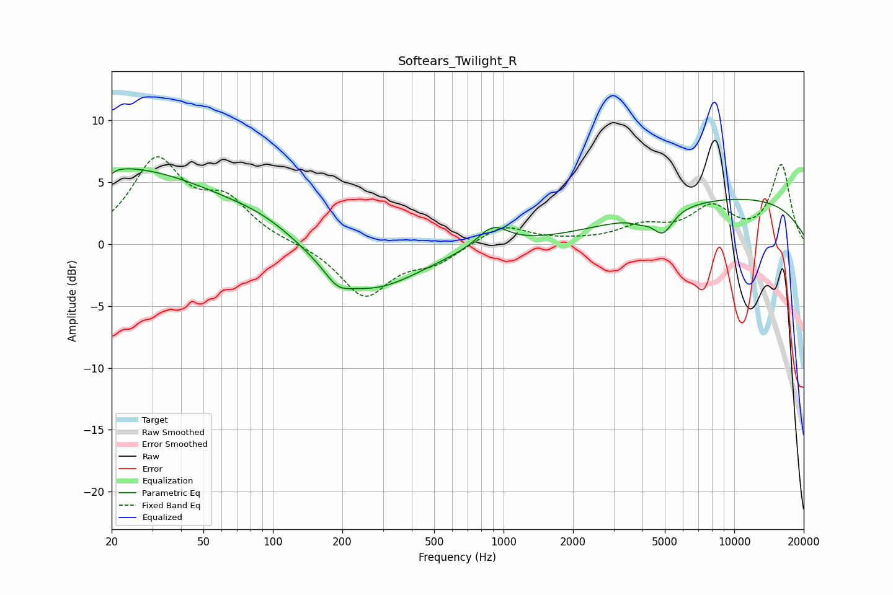

# Softears_Twilight_R
See [usage instructions](https://github.com/jaakkopasanen/AutoEq#usage) for more options and info.

### Parametric EQs
Apply preamp of -6.2 dB when using parametric equalizer.

|   # | Type    |   Fc (Hz) |    Q |   Gain (dB) |
|-----|---------|-----------|------|-------------|
|   1 | Peaking |        20 | 0.29 |         6.2 |
|   2 | Peaking |        20 | 5.93 |        -3.7 |
|   3 | Peaking |        20 | 5.97 |         3.1 |
|   4 | Peaking |        93 | 0.89 |         0.9 |
|   5 | Peaking |       191 | 2.55 |        -1.2 |
|   6 | Peaking |       260 | 0.66 |        -3.9 |
|   7 | Peaking |       897 | 2.11 |         1.7 |
|   8 | Peaking |      3899 | 3.46 |        -0.4 |
|   9 | Peaking |      4903 | 3.16 |        -1.9 |
|  10 | Peaking |     10000 | 0.26 |         3.7 |

### Fixed Band EQs
When using fixed band (also called graphic) equalizer, apply preamp of **-7.2 dB** (if available) and set gains manually with these parameters.

|   # | Type    |   Fc (Hz) |    Q |   Gain (dB) |
|-----|---------|-----------|------|-------------|
|   1 | Peaking |        31 | 1.41 |         6.5 |
|   2 | Peaking |        62 | 1.41 |         3.1 |
|   3 | Peaking |       125 | 1.41 |         0   |
|   4 | Peaking |       250 | 1.41 |        -4.2 |
|   5 | Peaking |       500 | 1.41 |        -1.3 |
|   6 | Peaking |      1000 | 1.41 |         1.6 |
|   7 | Peaking |      2000 | 1.41 |         0.1 |
|   8 | Peaking |      4000 | 1.41 |         1.3 |
|   9 | Peaking |      8000 | 1.41 |         2.7 |
|  10 | Peaking |     16000 | 1.41 |         6.3 |

### Graphs

