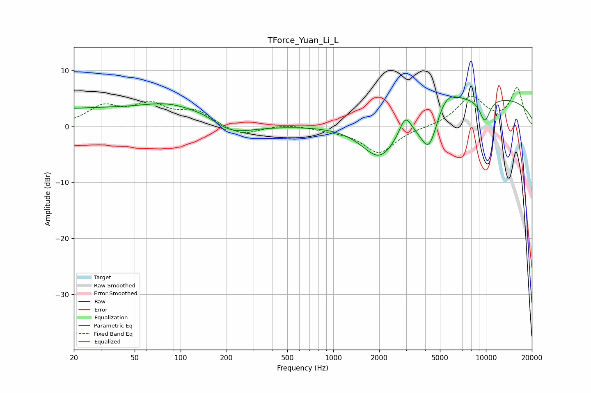

# TForce_Yuan_Li_L
See [usage instructions](https://github.com/jaakkopasanen/AutoEq#usage) for more options and info.

### Parametric EQs
Apply preamp of -5.4 dB when using parametric equalizer.

|   # | Type    |   Fc (Hz) |    Q |   Gain (dB) |
|-----|---------|-----------|------|-------------|
|   1 | Peaking |        27 | 0.18 |         3.2 |
|   2 | Peaking |        85 | 0.9  |         1.6 |
|   3 | Peaking |       145 | 1.26 |         1.1 |
|   4 | Peaking |       208 | 0.98 |        -2.5 |
|   5 | Peaking |      2032 | 1.09 |        -8   |
|   6 | Peaking |      2963 | 3.79 |         3.3 |
|   7 | Peaking |      4251 | 2.19 |        -8.3 |
|   8 | Peaking |      5402 | 1.69 |         3.8 |
|   9 | Peaking |      8783 | 0.18 |         5.3 |
|  10 | Peaking |      9837 | 3.53 |        -4.1 |

### Fixed Band EQs
When using fixed band (also called graphic) equalizer, apply preamp of **-7.0 dB** (if available) and set gains manually with these parameters.

|   # | Type    |   Fc (Hz) |    Q |   Gain (dB) |
|-----|---------|-----------|------|-------------|
|   1 | Peaking |        31 | 1.41 |         3.3 |
|   2 | Peaking |        62 | 1.41 |         3.5 |
|   3 | Peaking |       125 | 1.41 |         2.5 |
|   4 | Peaking |       250 | 1.41 |        -1.7 |
|   5 | Peaking |       500 | 1.41 |         0.4 |
|   6 | Peaking |      1000 | 1.41 |        -0.5 |
|   7 | Peaking |      2000 | 1.41 |        -4.7 |
|   8 | Peaking |      4000 | 1.41 |        -0.1 |
|   9 | Peaking |      8000 | 1.41 |         5.2 |
|  10 | Peaking |     16000 | 1.41 |         6.7 |

### Graphs

