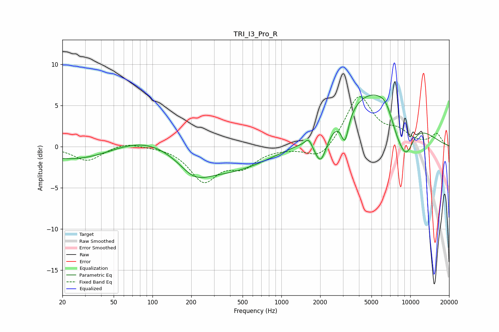

# TRI_I3_Pro_R
See [usage instructions](https://github.com/jaakkopasanen/AutoEq#usage) for more options and info.

### Parametric EQs
Apply preamp of -6.4 dB when using parametric equalizer.

|   # | Type    |   Fc (Hz) |    Q |   Gain (dB) |
|-----|---------|-----------|------|-------------|
|   1 | Peaking |        89 | 0.39 |         6.9 |
|   2 | Peaking |       110 | 0.18 |        -6.6 |
|   3 | Peaking |       211 | 1.27 |        -1.8 |
|   4 | Peaking |      1627 | 5.48 |         0.9 |
|   5 | Peaking |      2019 | 2.88 |        -3.9 |
|   6 | Peaking |      3111 | 4.87 |        -3.4 |
|   7 | Peaking |      5590 | 0.48 |         7.4 |
|   8 | Peaking |      6395 | 3.46 |         0.5 |
|   9 | Peaking |      7892 | 2.15 |        -2.3 |
|  10 | Peaking |      9281 | 1.96 |        -4.6 |

### Fixed Band EQs
When using fixed band (also called graphic) equalizer, apply preamp of **-6.2 dB** (if available) and set gains manually with these parameters.

|   # | Type    |   Fc (Hz) |    Q |   Gain (dB) |
|-----|---------|-----------|------|-------------|
|   1 | Peaking |        31 | 1.41 |        -1.7 |
|   2 | Peaking |        62 | 1.41 |         0.6 |
|   3 | Peaking |       125 | 1.41 |         0.1 |
|   4 | Peaking |       250 | 1.41 |        -4   |
|   5 | Peaking |       500 | 1.41 |        -2.1 |
|   6 | Peaking |      1000 | 1.41 |        -0.1 |
|   7 | Peaking |      2000 | 1.41 |        -1.8 |
|   8 | Peaking |      4000 | 1.41 |         6.2 |
|   9 | Peaking |      8000 | 1.41 |         1.5 |
|  10 | Peaking |     16000 | 1.41 |         1.5 |

### Graphs

